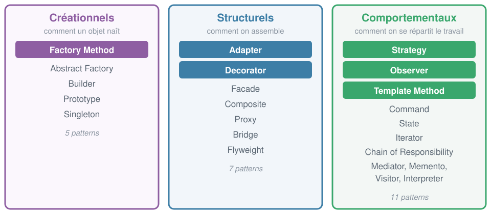
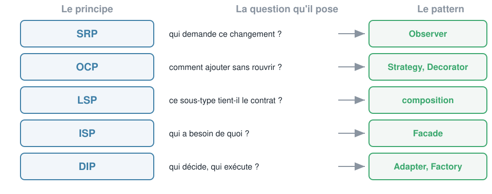

<!-- _class: lead -->

# Crafting Code
## Jour 2
### SOLID et les patrons de conception

Badmavasan KIROUCHENASSAMY
CODA

---

## Ce que vous saurez faire ce soir
### Les cinq sorties de la journée

- **Diagnostiquer** une conception rigide sans lire une ligne de métier
- **Expliquer** les cinq principes SOLID et le test que chacun rend possible
- **Situer** les trois familles du GoF et les 23 patrons
- **Appliquer** six patrons courants, en version classique et en version Python
- **Refuser** un patron quand il coûte plus qu'il ne rapporte

---

## Où on en est
### Ce que le jour 1 a réglé, et ce qu'il n'a pas réglé

| Réglé hier | Pas encore réglé |
|---|---|
| des noms qui disent l'intention | où placer les frontières entre modules |
| des fonctions courtes et testées | comment ajouter sans casser |
| la complexité mesurée et bornée | comment remplacer un composant |
| des bugs prouvés avant correction | comment tester ce qui touche le disque |

> Hier c'était l'échelle de la **ligne** et de la **fonction**. Aujourd'hui, l'échelle du **module**.

---

## Le déroulé
### 3 heures de cours, 5 heures de TP

| Bloc | Durée | Contenu |
|---|---|---|
| Acte 1 | 35 min | Pourquoi du code propre peut rester impossible à faire évoluer |
| Acte 2 | 65 min | Les cinq principes SOLID, un par un |
| Acte 3 | 60 min | Six patrons du GoF, en classique et en Python |
| Acte 4 | 20 min | Quand un patron est une erreur |
| TP2 | 5 h | Ajouter trois règles sans modifier une ligne existante |

---

<!-- _class: lead -->

# Acte 1
## Du code propre
### peut être impossible à faire évoluer

---

## Le code d'hier
### Ce que vous avez rendu au TP1

| Mesure | Valeur |
|---|---|
| Tests | 76 |
| Couverture de branches | 99 % |
| Complexité maximale | A (4) |
| Complexité moyenne | A (1.9) |
| Problèmes ruff | 0 |
| Fonctions de plus de 20 lignes | 0 |

> Sur tous les critères du jour 1, ce code est **irréprochable**. Regardons ce qui se passe quand la responsable logistique arrive lundi matin.

---

## Démo 1
### La demande du lundi matin

Trois demandes, toutes légitimes, toutes petites.

- Ajouter un niveau **préalerte**, entre `alerte` et `normal`
- Ajouter un **deuxième palier de remise** à partir de 500 unités
- Exporter le rapport en **CSV** en plus du JSON

> Chronométrez-moi. Et surtout, comptez les fichiers que je dois **rouvrir**.

---

<!-- _class: compare -->

## Demande 1, le niveau préalerte
### Il faut rouvrir une fonction qui marchait

#### Ce qui existe

```python
def niveau_alerte(article):
    if article.quantite == 0:
        return "rupture"
    if article.quantite * 2 <= article.seuil_alerte:
        return "critique"
    if article.est_en_alerte:
        return "alerte"
    return "normal"
```

#### Ce qu'il faut faire

```python
def niveau_alerte(article):
    if article.quantite == 0:
        return "rupture"
    if article.quantite * 2 <= article.seuil_alerte:
        return "critique"
    if article.est_en_alerte:
        return "alerte"
    if article.quantite <= article.seuil_alerte * 2:
        return "prealerte"          # nouveau
    return "normal"
```

> Une fonction **testée et en production** est rouverte pour une règle qui ne la concernait pas. Tous ses tests doivent être rejoués.

---

<!-- _class: compare -->

## Demande 2, le deuxième palier de remise
### Une règle métier arrive, une fonction stable est éditée

#### Ce qui existe

```python
def cout_de_reapprovisionnement(article):
    quantite = quantite_a_commander(article)
    if quantite == 0:
        return 0.0
    cout = quantite * article.prix_unitaire
    if quantite >= 100:
        cout *= 0.90
    return round(cout, 2)
```

#### Ce qu'il faut faire

```python
def cout_de_reapprovisionnement(article):
    quantite = quantite_a_commander(article)
    if quantite == 0:
        return 0.0
    cout = quantite * article.prix_unitaire
    if quantite >= 500:          # nouveau
        cout *= 0.80             # nouveau
    elif quantite >= 100:        # modifié
        cout *= 0.90
    return round(cout, 2)
```

> Notez le `elif`. Une ligne qui marchait a changé de nature. C'est exactement le genre de modification qui introduit une régression silencieuse.

---

<!-- _class: compare -->

## Demande 3, l'export CSV
### Le métier apprend un nouveau format de fichier

#### Ce qui existe

```python
def exporter_rapport(rapport, chemin):
    with open(chemin, "w", encoding="utf-8") as f:
        json.dump(asdict(rapport), f,
                  ensure_ascii=False, indent=2)
```

#### Ce qu'on va écrire, avouons-le

```python
def exporter_rapport(rapport, chemin, format="json"):
    if format == "json":
        with open(chemin, "w", encoding="utf-8") as f:
            json.dump(asdict(rapport), f)
    elif format == "csv":
        with open(chemin, "w", encoding="utf-8") as f:
            ecrivain = csv.writer(f)
            ecrivain.writerow(asdict(rapport).keys())
            ecrivain.writerow(asdict(rapport).values())
    else:
        raise ValueError(format)
```

> Un paramètre `format` avec un `if` dedans. On l'a tous écrit. Et dans six mois il y aura Excel, puis l'envoi par mail, puis le dépôt S3.

---

## Le bilan de la démo
### Trois petites demandes, voilà la facture

| Demande | Fichiers rouverts | Fonctions modifiées | Tests à rejouer |
|---|---|---|---|
| Niveau préalerte | 2 | 2 | 43 |
| Palier de remise | 1 | 1 | 43 |
| Export CSV | 1 | 1 | 43 |

- Aucune de ces trois demandes n'ajoute de la **complexité métier**
- Les trois obligent à toucher du code **qui marchait**
- Et le module de stock n'a que **190 lignes**

> Imaginez le même exercice sur 40 000 lignes.

---

## Les quatre symptômes
### Robert C. Martin, le vocabulaire du diagnostic


---

## À vous
### Lequel avez-vous déjà vécu ?

- **Rigidité** : vous annoncez trois jours pour ce que le client croit être une case à cocher
- **Fragilité** : la production casse à un endroit que personne n'a touché
- **Immobilité** : vous réécrivez une fonction qui existe déjà, parce que l'extraire est trop cher
- **Viscosité** : vous savez comment faire proprement, et vous ne le faites pas

> Ces quatre mots vous serviront plus en réunion que les 23 patrons du GoF.

---

## Ce qu'est vraiment la conception
### Une seule décision, répétée

La conception, ce n'est pas choisir des classes. C'est décider **où passent les frontières**.

- De quel côté de la frontière met-on cette règle ?
- Qu'est-ce qui a le droit de traverser ?
- Qu'est-ce qui change **ensemble**, et qu'est-ce qui change **séparément** ?

> Tout SOLID, tout le GoF, tout ce qu'on voit aujourd'hui répond à ces trois questions.

---

## Les deux seules notions à retenir
### Tout le reste en découle

**Cohésion**, à l'intérieur d'un module : est-ce que ces éléments ont une raison d'être ensemble ?

**Couplage**, entre modules : est-ce que changer l'un oblige à changer l'autre ?

L'objectif tient en une phrase : **forte cohésion, faible couplage**.

> Aucun des deux ne se mesure parfaitement. Les deux se sentent immédiatement à la lecture.

---

## Les quatre situations possibles
### Et une seule qui vous intéresse


---

## Mesurer le couplage sans outil
### Vos imports sont un aveu

```bash
grep -rn "^from \|^import " --include="*.py" . | grep -v test_
```

- Un module qui importe **8 autres modules** métier a 8 raisons de casser
- Un module que **personne** n'importe est soit mort, soit mal nommé
- Un import qui remonte du bas vers le haut (le métier importe la base) est une **inversion manquée**

> Le graphe de vos imports est le vrai plan de votre application. Pas le schéma sur le mur.

---

<!-- _class: compare -->

## Héritage ou composition
### La décision de conception la plus fréquente

#### Héritage : est un

```python
class ArticleSoldé(Article):
    def prix(self):
        return super().prix() * 0.7
```

- Relation figée à l'écriture
- On hérite de **tout**, y compris de ce qu'on ne veut pas
- Un seul axe de variation

#### Composition : a un

```python
class Article:
    def __init__(self, tarification):
        self.tarification = tarification

    def prix(self):
        return self.tarification.prix_de(self)
```

- Relation choisie à l'exécution
- On ne prend que ce dont on a besoin
- Plusieurs axes possibles

> Règle par défaut du GoF, page 20 du livre : **préférer la composition à l'héritage**. Pas l'interdire, la préférer.

---

## Ce que SOLID est, et n'est pas
### Avant d'entrer dans le détail

**Ce n'est pas** une liste de règles à cocher en revue de code.

**Ce n'est pas** une obligation d'écrire une interface pour chaque classe.

**C'est** cinq questions à se poser au moment où le code résiste.

> Un code qui ne change jamais n'a pas besoin de SOLID. Le jour où il change, SOLID vous dit **pourquoi ça fait mal**.

---

<!-- _class: lead -->

# Acte 2
## SOLID
### Cinq principes, cinq questions

---

## D'où ça vient
### Deux auteurs, treize ans d'écart

- Robert C. Martin rassemble les cinq principes vers **2000**, dans un article sur les principes de conception orientée objet
- Michael Feathers propose l'acronyme **SOLID** quelques années plus tard
- Deux des cinq sont plus anciens : **OCP** vient de Bertrand Meyer, 1988, et **LSP** de Barbara Liskov, 1987

> Ce ne sont pas des inventions récentes. Ce sont des constats faits dans les années 80 sur ce qui rendait les systèmes impossibles à maintenir.

---

## S comme Single Responsibility
### L'énoncé

> Une classe ne doit avoir **qu'une seule raison de changer**.

Reformulation de Martin, plus claire :

> Un module doit être responsable devant **un seul acteur**.

Un acteur, c'est une personne ou un service qui peut demander un changement. La comptabilité, la logistique, le service juridique, l'équipe front.

---

## La mauvaise lecture de SRP
### « Une fonction doit faire une seule chose »

Ça, c'est le jour 1. C'est vrai, et ce n'est pas SRP.

SRP ne parle pas de la **taille** du code, il parle de **qui vous appelle quand ça doit changer**.

- Une classe de 300 lignes qui ne sert qu'à la comptabilité respecte SRP
- Une classe de 20 lignes qui sert à la fois à la logistique et au juridique le viole

> La question n'est pas « combien de choses fait ce code ». C'est « combien de personnes différentes peuvent me demander de le modifier ».

---

<!-- _class: compare -->

## SRP sur le code d'hier
### Trois acteurs dans un seul fichier

#### Ce qu'on a

```python
# rapport.py
def generer_rapport(articles, date): ...
    # la logistique décide du contenu

def formater_rapport(rapport): ...
    # la direction décide de la présentation

def exporter_rapport(rapport, chemin): ...
    # l'informatique décide du format de fichier
```

#### Trois raisons de changer

| Qui demande | Ce qu'il change |
|---|---|
| Logistique | les seuils, les alertes |
| Direction | la mise en forme |
| Informatique | JSON, CSV, base |

Trois acteurs, trois rythmes, **un seul fichier**.

> Le jour où la direction veut une autre présentation, on rouvre le fichier qui contient le calcul métier. C'est de la fragilité fabriquée.

---

<!-- _class: compare -->

## SRP appliqué
### Trois fichiers, trois rythmes de changement

#### Avant

```
rapport.py
  generer_rapport()
  formater_rapport()
  exporter_rapport()
```

Un fichier, trois acteurs, trois raisons de changer.

#### Après

```
calcul/rapport.py
  generer_rapport()        logistique

presentation/texte.py
  formater()               direction

infrastructure/fichier.py
  DisqueLocal.deposer()    informatique
```

Le sens des dépendances : `presentation` et `infrastructure` connaissent `calcul`. **Jamais l'inverse.**

> Le test de SRP au quotidien : quand un ticket arrive, pouvez-vous dire en trois secondes quel fichier ouvrir ?

---

## Ce que SRP vous rend
### Un test qui devient trivial

Une fois séparés, le calcul se teste **sans rien mettre en forme**, et la mise en forme se teste **sans rien calculer**.

```python
def test_le_rapport_compte_les_articles():
    assert generer_rapport([un_article()], date(2026, 1, 1)).nombre_d_articles == 1

def test_le_format_affiche_aucune_quand_il_n_y_a_pas_d_alerte():
    assert "aucune" in formater(rapport_sans_alerte())
```

> Si tester une règle métier vous oblige à construire une chaîne de caractères, SRP est violé.

---

## O comme Open Closed
### L'énoncé, Bertrand Meyer, 1988

> Un module doit être **ouvert à l'extension** et **fermé à la modification**.

En clair : vous devez pouvoir ajouter un comportement en **ajoutant** du code, pas en **éditant** du code existant.

Le critère de vérification est mécanique, et c'est celui du TP de cet après-midi :

```bash
git diff --stat
```

> Si ajouter une règle produit des lignes supprimées dans un fichier existant, OCP est violé.

---

<!-- _class: compare -->

## OCP sur le code d'hier
### Le if qui grossit contre le registre qui s'étend

#### Fermé à l'extension

```python
def niveau_alerte(article):
    if article.quantite == 0:
        return "rupture"
    if article.quantite * 2 <= article.seuil:
        return "critique"
    if article.est_en_alerte:
        return "alerte"
    return "normal"
```

Ajouter un niveau = **rouvrir** la fonction.

#### Ouvert à l'extension

```python
NIVEAUX = []

def niveau(nom, priorite):
    def enregistrer(predicat):
        NIVEAUX.append((priorite, nom, predicat))
        return predicat
    return enregistrer

def niveau_alerte(article):
    for _, nom, convient in sorted(NIVEAUX):
        if convient(article):
            return nom
    return "normal"
```

Ajouter un niveau = **ajouter** un fichier.

---

## Le nouveau niveau, sans toucher à l'ancien code
### Un fichier neuf, et c'est tout

```python
# niveaux/prealerte.py
from niveaux import niveau

@niveau("prealerte", priorite=40)
def est_en_prealerte(article):
    return article.quantite <= article.seuil_alerte * 2
```

- Zéro ligne supprimée
- Zéro ligne modifiée
- Les 43 tests existants n'ont **aucune raison** d'être rejoués

> C'est exactement ce qui vous est demandé au TP2, et c'est vérifiable par un script.

---

## Les trois façons d'ouvrir un point de variation
### Par ordre de poids

| Technique | Comment | Coût |
|---|---|---|
| **Paramètre** | on passe un comportement en argument | quasi nul |
| **Registre** | un dictionnaire que les modules remplissent à l'import | faible |
| **Polymorphisme** | un protocole et plusieurs implémentations | réel |

- Commencez toujours par le **paramètre**
- Passez au **registre** quand les variantes viennent de fichiers séparés
- Gardez le **polymorphisme** pour les variantes qui ont un état et plusieurs méthodes

> Ouvrir n'oblige pas à créer une hiérarchie de classes. C'est le contresens le plus courant sur OCP.

---

## L'illusion de OCP
### Personne n'est ouvert à tout

Vous ne pouvez pas être ouvert à **toutes** les évolutions possibles. Essayer produit une usine à gaz.

OCP demande de choisir **un axe de variation** et de l'ouvrir, en connaissance de cause.

- Ouvert aux nouveaux **niveaux d'alerte** : oui, ça change tous les six mois
- Ouvert aux nouveaux **systèmes de mesure** : non, on ne passera pas au système impérial

> Le bon usage de OCP vient de l'expérience du domaine, pas de la lecture du principe. En cas de doute, la règle de trois de l'acte 4 tranche.

---

## L comme Liskov Substitution
### L'énoncé, Barbara Liskov, 1987

> Si `S` est un sous-type de `T`, on doit pouvoir remplacer un `T` par un `S` **sans que le programme s'en aperçoive**.

Autrement dit : un sous-type doit tenir **toutes les promesses** du type parent.

L'exemple du carré et du rectangle est célèbre et ne parle à personne. En voici un que vous rencontrerez.

---

<!-- _class: compare -->

## LSP, l'exemple qui arrive vraiment
### Le compte sans découvert

#### La classe de base

```python
class Compte:
    def retirer(self, montant):
        """Retire le montant et
        renvoie le nouveau solde."""
        self.solde -= montant
        return self.solde
```

Contrat implicite : **retirer marche toujours**.

#### Le sous-type qui trahit

```python
class CompteSansDecouvert(Compte):
    def retirer(self, montant):
        if montant > self.solde:
            raise SoldeInsuffisant()
        return super().retirer(montant)
```

Le sous-type **ajoute une précondition**. Tout code écrit pour `Compte` peut désormais exploser.

> Ce n'est pas le code qui est mauvais, c'est la **hiérarchie**. `CompteSansDecouvert` n'est pas un `Compte`, c'est autre chose.

---

<!-- _class: compare -->

## L'exemple canonique, en trente secondes
### Le carré et le rectangle

#### La hiérarchie qui semble évidente

```python
class Rectangle:
    def definir_largeur(self, l): self.l = l
    def definir_hauteur(self, h): self.h = h
    def aire(self): return self.l * self.h

class Carre(Rectangle):
    def definir_largeur(self, l):
        self.l = self.h = l
    def definir_hauteur(self, h):
        self.l = self.h = h
```

#### Le test qui casse

```python
def test_l_aire_suit_les_dimensions(forme):
    forme.definir_largeur(5)
    forme.definir_hauteur(4)
    assert forme.aire() == 20
```

Sur `Rectangle` : 20. Sur `Carre` : **16**.

> En mathématiques un carré est un rectangle. En programmation, `Carre` n'est pas un sous-type de `Rectangle`, parce qu'il ne tient pas ses promesses. **L'héritage suit le comportement, pas le vocabulaire.**

---

## La règle pratique de LSP
### Trois questions, et vous savez

Un sous-type a le droit d'**assouplir** ce qu'il exige et de **renforcer** ce qu'il garantit. Jamais l'inverse.

| Le sous-type | A le droit de | N'a pas le droit de |
|---|---|---|
| Préconditions, ce qu'il exige | en demander **moins** | en demander **plus** |
| Postconditions, ce qu'il garantit | en garantir **plus** | en garantir **moins** |
| Exceptions | en lever **moins** | en lever de **nouvelles** |

> Le signe qui ne trompe pas : une méthode redéfinie qui commence par `raise NotImplementedError` ou `if not supporté`.

---

## Le test de substituabilité
### Comment on le prouve, concrètement

On écrit les tests **une fois**, contre le type de base, et on les fait tourner sur chaque sous-type.

```python
@pytest.fixture(params=[Compte, CompteSansDecouvert])
def compte(request):
    return request.param(solde=100)


def test_un_retrait_renvoie_le_nouveau_solde(compte):
    assert compte.retirer(150) == -50
```

- Sur `Compte` : vert
- Sur `CompteSansDecouvert` : rouge

> C'est votre mission 5 de cet après-midi. Une suite de tests partagée est le seul moyen honnête de vérifier LSP.

---

## I comme Interface Segregation
### L'énoncé

> Aucun client ne doit être forcé de dépendre de méthodes qu'il **n'utilise pas**.

Le symptôme : pour utiliser une seule méthode, vous devez en implémenter douze, dont onze qui lèvent une exception.

Le remède : plusieurs petites interfaces **définies par le besoin du client**, pas par la richesse du fournisseur.

---

<!-- _class: compare -->

## ISP en Python
### Les Protocol, arrivés en 3.8

#### La grosse interface

```python
class Stockage(ABC):
    @abstractmethod
    def lire(self): ...
    @abstractmethod
    def ecrire(self, x): ...
    @abstractmethod
    def supprimer(self, x): ...
    @abstractmethod
    def archiver(self): ...
    @abstractmethod
    def restaurer(self): ...
```

Le module de lecture doit tout implémenter.

#### Le protocole du besoin

```python
from typing import Protocol

class Lisible(Protocol):
    def lire(self) -> bytes: ...

class Inscriptible(Protocol):
    def ecrire(self, contenu: bytes) -> None: ...

def afficher(source: Lisible): ...
```

Aucune déclaration d'héritage, aucun import chez le fournisseur.

> Un `Protocol` est vérifié par **structure**, pas par déclaration. C'est le typage canard, avec un contrôle statique en prime.

---

## Où déclarer l'interface
### La question qui tranche vraiment ISP

L'interface appartient au **client**, pas au fournisseur.

- `Lisible` est déclaré à côté de `afficher`, qui en a besoin
- Pas à côté de `FichierDisque`, qui se trouve la satisfaire

> Conséquence directe : le métier ne dépend plus jamais de l'infrastructure. Ce qui nous amène au cinquième principe.

---

## D comme Dependency Inversion
### L'énoncé

> Les modules de haut niveau ne doivent pas dépendre des modules de bas niveau. **Les deux** doivent dépendre d'abstractions.

> Les abstractions ne doivent pas dépendre des détails. Les **détails** doivent dépendre des abstractions.

Traduction : la **politique** ne doit jamais connaître le **mécanisme**.

- La politique : « un article sous son seuil déclenche une commande »
- Le mécanisme : PostgreSQL, un fichier JSON, un appel HTTP

---

## L'inversion, en image
### La flèche du bas se retourne


---

<!-- _class: compare -->

## DIP sur le code d'hier
### La seule fonction non couverte par les tests

#### Le métier connaît le disque

```python
def exporter_rapport(rapport, chemin):
    with open(chemin, "w") as f:
        json.dump(asdict(rapport), f)
```

Pour tester, il faut un **vrai fichier**. Donc on ne teste pas.

#### Le métier connaît un protocole

```python
class Destination(Protocol):
    def deposer(self, nom: str,
                contenu: str) -> None: ...

def exporter(rapport, destination: Destination):
    destination.deposer(
        f"rapport-{rapport.date_du_rapport}.json",
        json.dumps(asdict(rapport)),
    )
```

Le test injecte une destination en mémoire.

> Ce n'est pas un hasard si la seule fonction non couverte de votre TP1 est celle qui viole DIP. **La violation de DIP est visible dans le rapport de couverture.**

---

## Vous avez déjà fait du DIP hier
### Sans connaître le nom

```python
def est_majeur(date_naissance, aujourdhui):
    ...

def tarif_en_cours(entree, maintenant, est_abonne=False):
    ...
```

- L'horloge est un **détail**
- Le calcul d'âge est une **politique**
- Vous avez fait entrer le détail par un paramètre

> L'exigence E8 du TP1 était un exercice de DIP déguisé. Le principe n'est que la généralisation de ce réflexe.

---

## Les trois façons d'injecter
### Par ordre de préférence

| Forme | Quand | Exemple |
|---|---|---|
| Par **paramètre** | la dépendance change à chaque appel | `tarif_en_cours(entree, maintenant)` |
| Par le **constructeur** | la dépendance vaut pour la vie de l'objet | `Generateur(destination)` |
| Par **valeur par défaut** | il existe un choix évident, surchargeable | `def exporter(r, dest=DisqueLocal())` |

> La troisième est pratique et dangereuse : une valeur par défaut mutable partagée, c'est le piège du jour 1. Préférez `None` puis construction dans le corps.

---

## SOLID et vos tests
### Chaque principe débloque un type de test

| Principe | Ce qu'il rend testable |
|---|---|
| **SRP** | la règle métier, sans monter la mise en forme |
| **OCP** | le nouveau cas, sans rejouer l'ancien |
| **LSP** | une suite de tests partagée par toute la hiérarchie |
| **ISP** | un double léger, avec deux méthodes au lieu de douze |
| **DIP** | le métier, sans disque, sans réseau, sans base |

> C'est la vraie raison d'apprendre SOLID. Un code SOLID est un code qu'on peut tester vite, et un code qu'on teste vite est un code qu'on ose modifier.

---

## SOLID en une slide
### À photographier

| | Le principe | La question à se poser |
|---|---|---|
| **S** | une seule raison de changer | qui peut me demander de modifier ça ? |
| **O** | ouvert à l'extension, fermé à la modification | puis-je ajouter sans rouvrir ? |
| **L** | un sous-type tient les promesses du parent | puis-je le substituer sans rien casser ? |
| **I** | pas de dépendance sur l'inutilisé | mon client a-t-il besoin de tout ça ? |
| **D** | dépendre d'abstractions | la politique connaît-elle le mécanisme ? |

---

## Mini-activité, 5 minutes
### En binôme, quel principe est violé dans chaque extrait ?

```python
# A
def envoyer_facture(commande):
    total = sum(l.prix * l.qte for l in commande.lignes)
    corps = f"Total : {total} euros"
    smtplib.SMTP("smtp.interne").sendmail("no-reply@x.fr", commande.email, corps)
```

```python
# B
class Imprimante(Protocol):
    def imprimer(self): ...
    def scanner(self): ...
    def faxer(self): ...

class ImprimanteDeBureau:
    def faxer(self): raise NotImplementedError("pas de fax sur ce modèle")
```

```python
# C
def calculer_frais(commande):
    if commande.pays == "FR": return 4.90
    if commande.pays == "BE": return 7.50
    if commande.pays == "DE": return 8.20
    return 15.00
```

---

## La correction
### Et le piège de la question

| Extrait | Principe violé | Le signe qui le trahit |
|---|---|---|
| **A** | SRP et DIP | une fonction calcule, met en forme **et** ouvre une connexion SMTP |
| **B** | ISP et LSP | une méthode du protocole que l'implémentation refuse de tenir |
| **C** | OCP | un nouveau pays oblige à rouvrir la fonction |

Le piège : **aucun des trois n'est forcément à corriger**.

- L'extrait C est parfait si votre entreprise ne livre que dans ces trois pays depuis dix ans
- Il devient un problème le jour où le commercial signe un contrat en Espagne

> Un principe violé n'est pas un bug. C'est une **dette** dont il faut savoir si vous paierez les intérêts.

---

## Le piège de SOLID
### Ce que vous allez être tenté de faire

Sortir d'ici et créer une interface pour chaque classe, une factory pour chaque interface, et un module par fonction.

Ce n'est pas SOLID, c'est de la cérémonie.

- SOLID s'applique là où le code **résiste**, pas partout
- Un module stable depuis trois ans n'a besoin de rien
- L'abstraction prématurée coûte plus cher que la duplication

> On revient là-dessus à l'acte 4, et ce sera la partie la plus utile de la journée.

---

<!-- _class: lead -->

# Acte 3
## Les patrons de conception
### Ce que SOLID donne quand on l'applique

---

## Le livre
### Gamma, Helm, Johnson, Vlissides, 1994

- Quatre auteurs, d'où le surnom **Gang of Four**
- **23 patrons**, répartis en 3 familles
- Les exemples sont en C++ et en Smalltalk, le livre a plus de trente ans

Ce qu'ils ont fait n'est pas d'inventer des solutions. C'est d'avoir **donné un nom** à des solutions que tout le monde réinventait.

> Un patron, c'est du vocabulaire partagé. Dire « ici on met une Strategy » remplace dix minutes d'explication au tableau.

---

## Les trois familles
### Et les six qu'on traite aujourd'hui



---

## Pourquoi ces six-là
### Et pas les dix-sept autres

| Patron retenu | Ce qu'il vous servira à faire |
|---|---|
| **Strategy** | remplacer un `if` sur un comportement, le cas le plus fréquent |
| **Factory Method** | empêcher le métier d'importer des classes concrètes |
| **Adapter** | isoler une dépendance externe, indispensable en entreprise |
| **Decorator** | ajouter journal, cache ou réessai sans toucher au métier |
| **Observer** | réagir à un événement sans coupler l'émetteur aux réactions |
| **Template Method** | comprendre pourquoi vous allez souvent lui préférer Strategy |

> Les dix-sept autres se lisent en une soirée sur refactoring.guru **une fois** que vous maîtrisez ces six. Dans l'autre ordre, ça ne rentre pas.

---

## Ce qu'un patron est, et n'est pas
### Avant de regarder du code

**Ce n'est pas** une bibliothèque à importer.

**Ce n'est pas** une recette à appliquer par précaution.

**C'est** la description d'un problème récurrent, d'une solution, et de ses conséquences. Le livre consacre autant de place aux conséquences qu'à la solution, et c'est la partie que personne ne lit.

> Un patron appliqué sans le problème correspondant est un patron **mal appliqué**.

---

## La carte de la journée
### Chaque patron répond à un principe



---

<!-- _class: lead -->

## Patron 1
### Strategy

---

## Strategy
### Le problème

Vous avez plusieurs façons de faire **la même chose**, et il faut choisir à l'exécution.

- Plusieurs modes de calcul de tarif
- Plusieurs politiques de remise
- Plusieurs stratégies de tri

L'intention, telle qu'écrite dans le livre : définir une famille d'algorithmes, les encapsuler, et les rendre **interchangeables**.

> Le symptôme qui appelle Strategy : un `if` ou un `match` sur un **type de comportement**, qui grossit à chaque demande client.

---

<!-- _class: compare -->

## Strategy
### Version GoF contre version Python

#### La version du livre

```python
class Remise(Protocol):
    def appliquer(self, montant: float) -> float: ...

class SansRemise:
    def appliquer(self, montant): return montant

class RemiseAbonne:
    def appliquer(self, montant): return montant * 0.6

class Tarificateur:
    def __init__(self, remise: Remise):
        self.remise = remise

    def total(self, montant):
        return self.remise.appliquer(montant)
```

#### La version Python

```python
def sans_remise(montant):
    return montant

def remise_abonne(montant):
    return montant * 0.6

def total(montant, remise=sans_remise):
    return remise(montant)
```

En Python, une fonction **est** un objet. La classe à une seule méthode n'apporte rien.

> Même patron, même intention, une ligne au lieu de quinze. Gardez la version objet quand la stratégie a **un état** ou **plusieurs méthodes**.

---

<!-- _class: compare -->

## Strategy sur votre kata parking
### Les trois réductions du TP1 sont déjà trois stratégies

#### Ce que vous avez écrit hier

```python
def tarif(duree, est_abonne=False,
          est_electrique=False):
    ...
    montant = min(tranches, plafond)
    if est_abonne:
        montant *= 0.60
    return round(montant, 2)
```

Chaque nouveau statut ajoute un booléen et un `if`.

#### Ce que ça devient

```python
def plein_tarif(montant):
    return montant

def tarif_abonne(montant):
    return montant * 0.60

def tarif_personnel(montant):
    return 0.0

def tarif(duree, reduction=plein_tarif, ...):
    return round(reduction(min(tranches, plafond)), 2)
```

> Le statut « personnel de la mairie » arrive la semaine prochaine. Colonne de gauche : un booléen de plus dans la signature. Colonne de droite : **trois lignes dans un fichier neuf**.

---

## Strategy
### Quand l'utiliser, quand s'abstenir

| Utilisez-le si | Abstenez-vous si |
|---|---|
| les variantes se comptent en dizaines | il y en a deux, stables depuis des années |
| elles arrivent de l'extérieur, plugins, config | elles sont connues à la compilation |
| chaque variante a des tests propres | le `if` tient en trois lignes lisibles |

> Strategy est le patron le plus utile et le plus sur-utilisé. C'est votre premier réflexe au TP2, et votre premier doute.

---

<!-- _class: lead -->

## Patron 2
### Factory Method

---

## Factory Method
### Le problème

Le code de haut niveau doit créer un objet, mais **ne doit pas savoir lequel**.

```python
def generer(articles, format):
    if format == "json":
        ecrivain = EcrivainJSON()      # le métier connaît la classe concrète
    elif format == "csv":
        ecrivain = EcrivainCSV()
    ...
```

- Le module métier **importe** toutes les implémentations
- Ajouter un format oblige à rouvrir le métier
- Le test doit gérer les vraies classes

---

<!-- _class: compare -->

## Factory Method
### Version GoF contre version Python

#### La version du livre

```python
class FabriqueEcrivain(ABC):
    @abstractmethod
    def creer(self) -> Ecrivain: ...

class FabriqueJSON(FabriqueEcrivain):
    def creer(self):
        return EcrivainJSON()

class FabriqueCSV(FabriqueEcrivain):
    def creer(self):
        return EcrivainCSV()
```

#### La version Python

```python
ECRIVAINS = {}

def enregistrer(nom):
    def decorateur(classe):
        ECRIVAINS[nom] = classe
        return classe
    return decorateur

def creer_ecrivain(nom):
    if nom not in ECRIVAINS:
        raise FormatInconnu(nom)
    return ECRIVAINS[nom]()
```

> Le registre est la forme Python de la fabrique. Et comme il se remplit par import, ajouter un format devient un **fichier neuf**, donc du OCP.

---

<!-- _class: lead -->

## Patron 3
### Adapter

---

## Adapter
### Le problème

Vous avez un composant qui fait le travail, mais **pas avec la bonne forme**.

- Une bibliothèque externe dont vous n'aimez pas l'interface
- Un vieux module qu'on ne peut pas modifier
- Un service dont l'interface va changer et que vous voulez isoler

L'Adapter traduit une interface en une autre, sans toucher ni au client ni au fournisseur.

> C'est la mise en œuvre la plus directe de DIP : vous définissez l'interface dont **vous** avez besoin, et vous adaptez le monde extérieur à elle.

---

<!-- _class: compare -->

## Adapter
### Le fournisseur ne bouge pas, vous non plus

#### Ce que le fournisseur impose

```python
class ClientSMSExterne:
    def send_message(self, to, body,
                     priority=1, retry=3):
        ...
```

Votre métier ne devrait pas connaître `priority` ni `retry`.

#### L'interface dont vous avez besoin

```python
class Notificateur(Protocol):
    def prevenir(self, destinataire: str,
                 texte: str) -> None: ...

class NotificateurSMS:
    def __init__(self, client):
        self._client = client

    def prevenir(self, destinataire, texte):
        self._client.send_message(
            to=destinataire, body=texte
        )
```

> Le jour où vous changez de fournisseur, **un seul fichier** change. Et vos tests métier n'ont jamais vu passer un SMS.

---

## Ce que l'Adapter fait à vos tests
### Le vrai bénéfice, il n'est pas dans le diagramme

```python
class NotificateurEnMemoire:
    def __init__(self):
        self.envoyes = []

    def prevenir(self, destinataire, texte):
        self.envoyes.append((destinataire, texte))


def test_une_rupture_previent_la_logistique():
    notificateur = NotificateurEnMemoire()
    signaler_rupture(article_vide(), notificateur)
    assert notificateur.envoyes == [("logistique@x.fr", "VIS-M6 en rupture")]
```

- Aucun SMS envoyé, aucun réseau, aucune clé d'API dans les tests
- Le test s'exécute en **microsecondes**
- Il tourne dans la CI sans configuration

> Douze lignes de double, et une règle métier devient testable pour toujours.

---

<!-- _class: lead -->

## Patron 4
### Decorator

---

## Decorator
### Le problème

Vous voulez ajouter un comportement **autour** d'un objet existant, et pouvoir les empiler.

- Journaliser les appels
- Mettre en cache le résultat
- Mesurer le temps passé
- Réessayer en cas d'échec

Faire tout ça par héritage donne une explosion combinatoire : `EcrivainJSONAvecCacheEtJournalEtReessai`.

> Le Decorator implémente **la même interface** que ce qu'il enveloppe. C'est ce qui permet de l'empiler indéfiniment.

---

<!-- _class: compare -->

## Decorator
### On enveloppe, on n'hérite pas

#### Le décoré et le décorateur

```python
class EcrivainJSON:
    def deposer(self, nom, contenu):
        ...

class AvecJournal:
    def __init__(self, suivant):
        self._suivant = suivant

    def deposer(self, nom, contenu):
        journal.info("dépôt de %s", nom)
        self._suivant.deposer(nom, contenu)
```

#### On empile

```python
destination = AvecJournal(
    AvecReessai(
        EcrivainJSON()
    )
)

destination.deposer("rapport.json", contenu)
```

Chaque couche ignore les autres. On en ajoute une sans toucher aux existantes.

> Attention au faux ami : le `@decorateur` de Python n'est **pas** le patron Decorator. Il en est un cas particulier quand il enveloppe une fonction en gardant sa signature.

---

<!-- _class: lead -->

## Patron 5
### Observer

---

## Observer
### Le problème

Quand un événement se produit, **plusieurs choses** doivent réagir, et l'émetteur ne doit pas savoir lesquelles.

Un article passe en rupture. Il faut :

- prévenir la logistique par mail
- écrire une ligne dans le journal
- déclencher une commande fournisseur
- mettre à jour le tableau de bord

> Sans Observer, la fonction qui détecte la rupture importe les quatre modules. Elle a quatre raisons de changer et elle est intestable.

---

<!-- _class: compare -->

## Observer
### L'émetteur ne connaît personne

#### Le sujet observé

```python
class DetecteurDeRupture:
    def __init__(self):
        self._abonnes = []

    def s_abonner(self, reaction):
        self._abonnes.append(reaction)

    def verifier(self, article):
        if article.quantite == 0:
            for reagir in self._abonnes:
                reagir(article)
```

#### Les abonnés

```python
detecteur = DetecteurDeRupture()
detecteur.s_abonner(prevenir_logistique)
detecteur.s_abonner(journaliser)
detecteur.s_abonner(commander_chez_fournisseur)
```

Le test n'abonne qu'une liste :

```python
recus = []
detecteur.s_abonner(recus.append)
```

> Ajouter une réaction ne touche pas au détecteur. C'est du SRP pour lui, et du OCP pour le système.

---

## Observer
### Les deux pièges

**L'ordre d'exécution.** Rien ne le garantit. Si une réaction dépend d'une autre, ce n'est pas un Observer qu'il vous faut.

**Les erreurs.** Si un abonné lève une exception, que deviennent les suivants ? Décidez, et écrivez le test.

```python
def test_un_abonne_en_echec_n_empeche_pas_les_autres():
    detecteur.s_abonner(lambda a: 1 / 0)
    detecteur.s_abonner(recus.append)
    detecteur.verifier(article_en_rupture())
    assert recus == [article_en_rupture()]
```

> C'est le patron qui produit le plus de bugs de production silencieux. Testez le chemin d'erreur.

---

<!-- _class: lead -->

## Patron 6
### Template Method

---

<!-- _class: compare -->

## Template Method
### Le squelette dans le parent, les trous dans l'enfant

#### La structure

```python
class ExportDeRapport(ABC):
    def exporter(self, rapport):
        contenu = self.serialiser(rapport)
        self.ecrire(self.nom(rapport), contenu)
        journal.info("export terminé")

    @abstractmethod
    def serialiser(self, rapport): ...

    @abstractmethod
    def nom(self, rapport): ...
```

#### L'implémentation

```python
class ExportJSON(ExportDeRapport):
    def serialiser(self, rapport):
        return json.dumps(asdict(rapport))

    def nom(self, rapport):
        return f"{rapport.date}.json"
```

> L'enchaînement est figé dans le parent, les étapes sont fournies par l'enfant. C'est l'inversion de contrôle sous sa forme la plus simple.

---

## Template Method
### Pourquoi on lui préfère souvent Strategy

| Template Method | Strategy |
|---|---|
| repose sur l'**héritage** | repose sur la **composition** |
| un seul axe de variation | plusieurs axes combinables |
| choisi à l'écriture | choisi à l'exécution |
| l'enfant dépend du parent | les deux dépendent d'un protocole |

Et surtout : Template Method est un terrain **naturel de violations LSP**, puisqu'il invite l'enfant à redéfinir des morceaux du comportement du parent.

> Gardez-le pour un enchaînement vraiment figé et partagé. Sinon, composez.

---

<!-- _class: compare -->

## Deux patrons que vous croiserez sans les chercher
### Facade et Composite

#### Facade, réponse à ISP

```python
# 4 modules, 12 appels, un ordre à respecter
inventaire.charger()
prix.recalculer()
alertes.rafraichir()
rapport.generer()

# devient
class ServiceDeStock:
    def cloture_mensuelle(self, date):
        ...
```

Une porte d'entrée simple sur un sous-système compliqué.

#### Composite, l'arbre et la feuille

```python
class Entrepot:
    def __init__(self, contenus):
        self._contenus = contenus

    def valeur(self):
        return sum(c.valeur()
                   for c in self._contenus)
```

Un entrepôt, une allée, un carton, un article : **la même interface**. Le client ne sait pas s'il parle à une feuille ou à une branche.

> Facade **cache** de la complexité. Composite **efface** la différence entre l'un et le multiple.

---

## Singleton
### Pourquoi il est dans le livre, pourquoi on l'évite

Le problème annoncé : garantir qu'il n'existe **qu'une seule instance**.

Le problème réel qu'il crée :

- C'est une **variable globale** avec un costume
- Les tests partagent l'état, donc l'ordre des tests compte, donc ils deviennent capricieux
- Impossible d'injecter un double, donc DIP est violé par construction

> En Python, un module **est** déjà un singleton. Si vous voulez une seule instance, créez-la une fois au démarrage et passez-la en paramètre. C'est tout.

---

## Quel problème, quel patron
### Le tableau à garder

| Ce que vous constatez | Ce que vous regardez |
|---|---|
| un `if` sur un type de comportement qui grossit | **Strategy** |
| le métier importe des classes concrètes | **Factory Method** |
| une interface externe qui ne vous convient pas | **Adapter** |
| des comportements à empiler autour d'un objet | **Decorator** |
| un événement, plusieurs réactions inconnues | **Observer** |
| un enchaînement figé avec des trous | **Template Method** |
| douze méthodes dont le client en utilise deux | **Facade** |
| une arborescence traitée comme une feuille | **Composite** |

---

## Mini-activité, 4 minutes
### Quel patron pour chaque situation ?

- **1.** Le client veut choisir entre envoi par mail, par SMS et par notification push, et en ajoutera d'autres
- **2.** Vous intégrez une API de transporteur dont les noms de champs sont en allemand
- **3.** Toutes les requêtes vers la base doivent désormais être journalisées et mises en cache
- **4.** Quand une commande est validée, quatre services différents doivent réagir
- **5.** Le module de facturation importe `PostgresClient` directement

> Une minute de réflexion, puis on compare. Plusieurs réponses sont défendables, c'est la justification qui compte.

---

## La correction
### Et pourquoi plusieurs réponses tiennent

| # | Réponse attendue | Réponse aussi valable |
|---|---|---|
| 1 | **Strategy**, une fonction par canal | **Factory** si le choix vient d'une configuration |
| 2 | **Adapter**, votre vocabulaire d'un côté, le leur de l'autre | rien, si l'API ne sert qu'à un endroit |
| 3 | **Decorator**, deux couches empilables | **Proxy**, si c'est le même objet qu'on remplace |
| 4 | **Observer**, les quatre s'abonnent | une simple liste d'appels, s'il n'y en aura jamais cinq |
| 5 | **DIP**, un protocole côté facturation | **Adapter** si le client externe ne convient pas |

> La deuxième colonne compte autant que la première. Un patron qu'on choisit sans savoir ce qu'on écarte n'est pas un choix.

---

## Ce que Python change vraiment
### À savoir avant d'appliquer un livre de 1994

| Patron GoF | En Python |
|---|---|
| Strategy | une fonction passée en paramètre |
| Factory Method | un dictionnaire de constructeurs |
| Singleton | un module, ou une instance créée au démarrage |
| Iterator | dans le langage, `__iter__` et `yield` |
| Command | une fonction, ou `functools.partial` |
| Decorator | souvent une classe enveloppante, parfois `@` |
| Template Method | souvent remplacé par Strategy |

> Le livre a été écrit pour des langages sans fonctions de première classe. La moitié de ses patrons compensent une absence que Python n'a pas.

---

<!-- _class: lead -->

# Acte 4
## Quand un patron
### est une erreur

---

## Le coût de l'indirection
### Ce que vous payez à chaque abstraction

- **Lecture** : pour suivre un appel, il faut ouvrir trois fichiers au lieu d'un
- **Débogage** : la pile d'appels double, et le nom de la classe ne dit plus ce qu'elle fait
- **Accueil** : un nouvel arrivant met des jours à comprendre une usine de quinze lignes utiles
- **Exécution** : chaque couche est un appel de méthode, un objet de plus, de la mémoire

> Aucun de ces coûts n'apparaît dans une revue de code. Tous apparaissent six mois plus tard.

---

## Le moment où un patron devient rentable
### La courbe qu'il faut avoir en tête


---

## La règle de trois
### La seule heuristique qui tient

**Première occurrence** : vous écrivez le code.

**Deuxième occurrence** : vous dupliquez, et vous notez que c'est la deuxième.

**Troisième occurrence** : maintenant vous abstrayez, parce que vous voyez enfin ce qui varie **et** ce qui ne varie pas.

> Abstraire à la première occurrence, c'est deviner l'axe de variation. Vous vous tromperez, et une mauvaise abstraction coûte plus cher que trois duplications.

---

<!-- _class: compare -->

## Deux variantes ne justifient pas un patron
### Le même besoin, deux écritures

#### Avec Strategy

```python
class Remise(Protocol):
    def appliquer(self, m): ...

class Aucune:
    def appliquer(self, m): return m

class Abonne:
    def appliquer(self, m): return m * 0.6

def total(m, remise: Remise):
    return remise.appliquer(m)
```

4 fichiers, 3 classes, 2 tests de plus.

#### Sans

```python
def total(montant, est_abonne=False):
    if est_abonne:
        return montant * 0.6
    return montant
```

1 fonction, 2 tests, lisible en 3 secondes.

> À deux variantes stables, la colonne de droite gagne. Le jour où une troisième arrive, vous faites l'extraction, **avec les tests qui existent déjà**.

---

## La tension YAGNI contre OCP
### Elle est réelle, et on ne peut pas la supprimer

**YAGNI** dit : n'écris pas ce dont tu n'as pas besoin aujourd'hui.

**OCP** dit : prépare l'extension pour ne pas rouvrir demain.

La résolution n'est pas un compromis mou, c'est une règle de priorité :

- Par défaut, **YAGNI gagne**
- OCP s'applique quand vous avez une **preuve** de variation : trois occurrences, ou une demande client déjà écrite

> Refactoriser vers un patron quand le besoin arrive est **peu coûteux** si vous avez des tests. C'est tout l'intérêt du jour 1.

---

## Les signes de la pattern-itis
### Relisez votre propre code du TP

- Une interface qui n'a **qu'une seule** implémentation, et aucune perspective d'une deuxième
- Une fabrique qui renvoie toujours le même type
- Un nom de classe qui contient le nom du patron plutôt que le nom du métier
- Plus de fichiers de conception que de fichiers de règles métier
- Vous ne savez pas expliquer à voix haute **quel problème** ce patron résout ici

> Ce dernier point est le critère du TP2 : vous devrez écrire, pour chaque patron introduit, pourquoi vous auriez pu ne pas le faire.

---

## Le lien avec l'éco-conception
### Une amorce pour le jour 4

Chaque couche d'indirection a un coût mesurable à l'exécution : des appels, des objets, de la mémoire, des cycles.

Sur un service appelé un million de fois par jour, une chaîne de cinq décorateurs inutiles se voit sur la facture d'électricité.

- Le code le plus sobre n'est **pas** le code le plus abstrait
- Ce n'est pas non plus le code illisible que personne n'ose optimiser
- On mesurera ça au jour 4, avec des outils

> Bien concevoir, c'est mettre l'abstraction là où le changement arrive, et nulle part ailleurs.

---

## Le test du nouvel arrivant
### La seule évaluation honnête de votre conception

Prenez la personne la plus récente de l'équipe. Donnez-lui un ticket réel, petit.

Chronométrez le temps qu'elle met à **trouver où modifier**.

| Ce que vous observez | Ce que ça dit |
|---|---|
| moins de 5 minutes | la conception porte |
| elle ouvre plus de 5 fichiers pour comprendre | trop d'indirection |
| elle vous demande où est la règle | les noms ne correspondent pas au métier |
| elle modifie le mauvais endroit et les tests passent | il manque des tests, pas des patrons |

> Aucune métrique ne remplace cette observation. Faites-la une fois par trimestre.

---

## La question à se poser avant chaque patron
### Quatre secondes de réflexion, des mois d'économie

1. Quel **changement précis** est-ce que j'anticipe ?
2. Est-ce qu'il est déjà arrivé **trois fois**, ou est-ce que je le devine ?
3. Combien de fichiers un lecteur devra-t-il ouvrir **après** mon changement ?
4. Si je me trompe, combien coûte le retour en arrière ?

> Si vous ne pouvez pas répondre à la première question par une phrase métier, n'introduisez pas le patron.

---

## Ce qu'on garde de la journée
### Six phrases

- La conception, c'est décider **où passent les frontières**
- **Forte cohésion, faible couplage**, tout le reste en découle
- SOLID n'est pas une checklist, ce sont **cinq questions** posées quand le code résiste
- Un patron est du **vocabulaire partagé**, pas une preuve de compétence
- La **règle de trois** tranche entre YAGNI et OCP
- Un code SOLID est surtout un code **facile à tester**, et donc facile à changer

> Et le corollaire de tout ça : sans les tests du jour 1, rien de ce qu'on a vu aujourd'hui n'est applicable sans risque.

---

<!-- _class: lead -->

# TP2
## 5 heures
### Ajouter sans rien casser

---

## L'énoncé en une slide
### Six missions, votre dépôt du TP1

| Mission | Durée | Ce que vous faites |
|---|---|---|
| 0 | 20 min | repartir de votre TP1, ou de la solution de référence |
| 1 | 40 min | audit de rigidité, sans métriques cette fois |
| 2 | 70 min | SRP et DIP, rendre testable ce qui touche le disque |
| 3 | 80 min | **trois règles nouvelles sans modifier une ligne** |
| 4 | 50 min | deux patrons, justifiés **et** contre-argumentés |
| 5 | 30 min | prouver une violation LSP par un test, puis la corriger |

> Tout est dans `tp2/README.md`. La solution du TP1 est dans `tp1/solution/`.

---

## Ce qui est évalué
### La preuve mécanique du jour 2

Hier on rejouait vos commits `red:`. Aujourd'hui on lit vos diffs.

```bash
./outils/verifier-ocp.sh /chemin/vers/votre/depot
```

Le script vérifie que, entre votre commit de départ et votre rendu, les fichiers métier existants n'ont **aucune ligne supprimée ni modifiée**, et que chaque règle ajoutée est couverte par un test.

> Un code qui marche en ayant édité l'existant vaut moins qu'un code équivalent obtenu en ajoutant.

---

## Le barème du TP2
### Ce qui rapporte des points

| Ce qui est évalué | Points |
|---|---|
| Hygiène du dépôt et convention de commits | 1 |
| Mission 1 : audit de rigidité, chiffré en fichiers et en tests | 2 |
| Mission 2 : SRP et DIP appliqués, tests verts en permanence | 4 |
| Mission 3 : trois règles ajoutées, **zéro ligne existante modifiée** | 6 |
| Mission 3 : chaque règle couverte par ses propres tests | 2 |
| Mission 4 : deux patrons, justifiés **et** contre-argumentés | 3 |
| Mission 5 : violation LSP prouvée par un test, puis corrigée | 2 |
| **Total** | **20** |

> La mission 3 pèse 8 points sur 20. C'est la compétence de la journée.

---

## Les ressources du jour
### Cinq références

- Gamma, Helm, Johnson, Vlissides, *Design Patterns*, 1994
- Robert C. Martin, *Clean Architecture*, 2017, pour SOLID en contexte
- Barbara Liskov, *Data Abstraction and Hierarchy*, 1987
- Sandi Metz, *Practical Object-Oriented Design*, pour la composition
- refactoring.guru, pour les 23 patrons avec du code Python

---

## Demain
### Jour 3

| Sujet | Ce qu'on fera |
|---|---|
| Code legacy | des tests de caractérisation sur du code qu'on ne comprend pas |
| Coutures | comment casser une dépendance sans tests préalables |
| Odeurs | le catalogue complet de Fowler, appliqué |
| Débogage | identifier, reproduire et corriger un bug avec une méthode |

> On travaillera sur une base de code que vous n'aurez jamais vue, et qui n'aura aucun test.

Bon TP.
