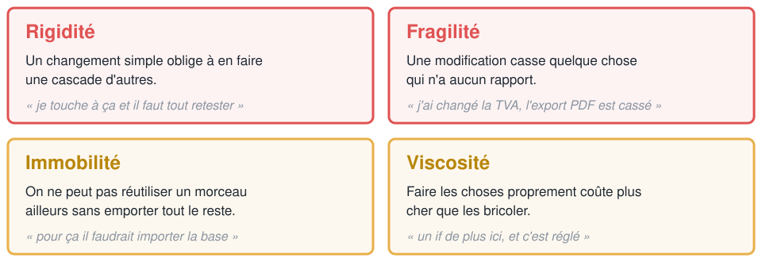
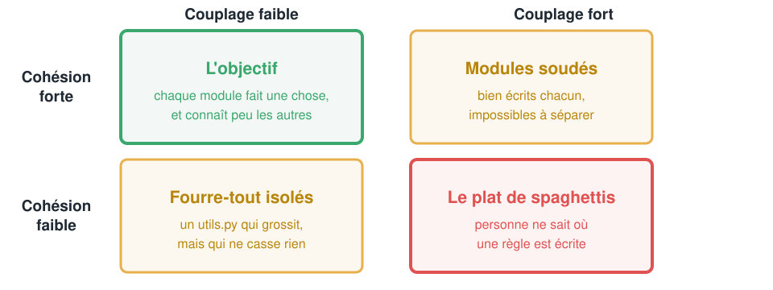
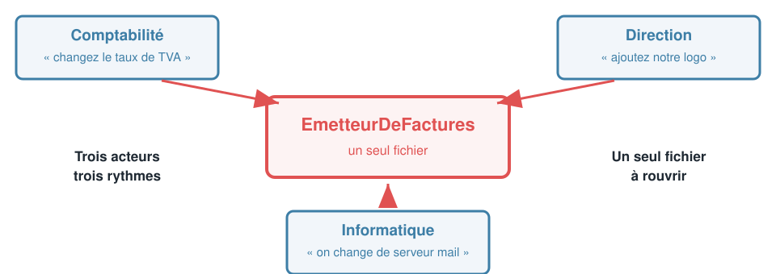
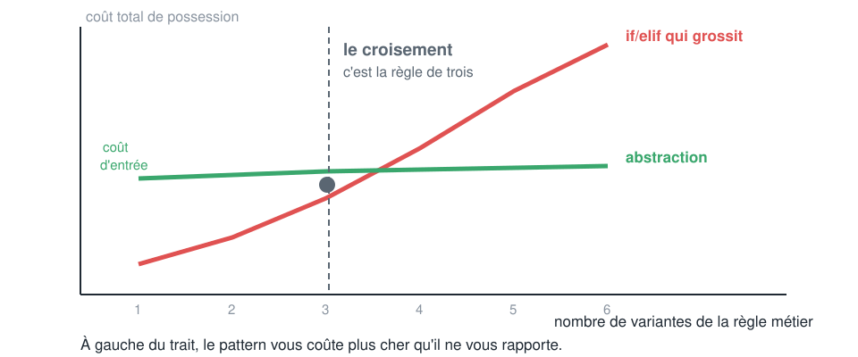
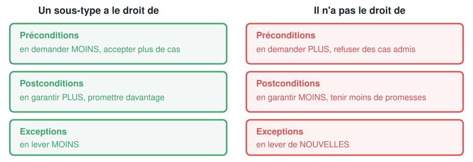
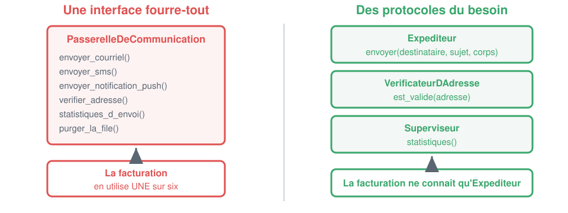
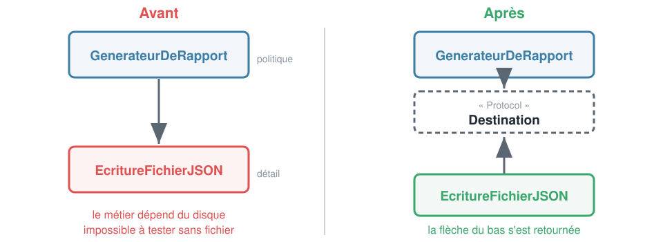
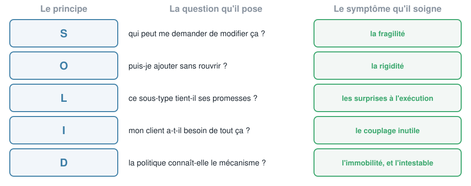

<!-- _class: lead -->

# Crafting Code
## Jour 2
### Les cinq principes SOLID

Badmavasan KIROUCHENASSAMY
CODA

---

## Ce que vous saurez faire ce soir
### Les cinq sorties de la journée

- **Diagnostiquer** une conception rigide sans connaître le métier
- **Énoncer** chacun des cinq principes, et dire ce qu'il **ne veut pas** dire
- **Repérer** une violation sur du code réel, avec des signes concrets
- **Corriger** en petits pas, sans casser les tests existants
- **Refuser** d'appliquer un principe quand il coûte plus qu'il ne rapporte

---

## Où on en est
### Ce que le jour 1 a réglé, et ce qu'il n'a pas réglé

| Réglé hier | Pas encore réglé |
|---|---|
| des noms qui disent l'intention | où placer les frontières entre modules |
| des fonctions courtes et testées | comment ajouter sans rouvrir |
| la complexité mesurée et bornée | comment remplacer un composant |
| des bugs prouvés avant correction | comment tester ce qui touche le réseau |

> Hier c'était l'échelle de la **ligne** et de la **fonction**. Aujourd'hui, l'échelle du **module**.

---

## Le déroulé
### 3 heures de cours, 5 heures de TP

| Bloc | Durée | Contenu |
|---|---|---|
| Acte 1 | 25 min | Pourquoi du code propre peut rester impossible à faire évoluer |
| Acte 2 | 28 min | **S**, une seule raison de changer |
| Acte 3 | 33 min | **O**, ouvert à l'extension |
| Acte 4 | 28 min | **L**, la substitution |
| Acte 5 | 22 min | **I**, des interfaces à la taille du besoin |
| Acte 6 | 28 min | **D**, l'inversion des dépendances |
| Acte 7 | 16 min | Synthèse, et quand ne pas appliquer |
| TP2 | 5 h | Cinq violations dans un code en service, à vous de jouer |

---

<!-- _class: lead -->

# Acte 1
## Du code propre
### peut être impossible à faire évoluer

---

## Le code du TP2
### Ce que vous allez recevoir cet après-midi

| Mesure | Valeur |
|---|---|
| Tests | 25, tous verts |
| Complexité maximale | A |
| Complexité moyenne | A (1.70) |
| Problèmes ruff | 0 |
| Fonctions de plus de 20 lignes | 0 |
| Noms compréhensibles sans commentaire | oui |

> Sur **tous** les critères d'hier, ce code est irréprochable. Regardons ce qui se passe quand le commercial arrive lundi matin.

---

## Démo 1
### Trois demandes, toutes légitimes, toutes petites

- Ajouter une formule **`decouverte`** à 4 euros par poste
- Ajouter un code promo **`RENTREE`**, 10 % en septembre
- Envoyer la facture par **SMS** en plus du courriel

> Chronométrez-moi. Et surtout, comptez les fichiers que je dois **rouvrir**.

---

<!-- _class: compare -->

## Demande 1, la formule découverte
### Il faut rouvrir une fonction qui marchait

#### Ce qui existe

```python
def prix_par_poste(formule):
    if formule == FORMULE_ESSENTIEL:
        return 9.0
    if formule == FORMULE_PRO:
        return 19.0
    if formule == FORMULE_ENTREPRISE:
        return 39.0
    raise FormuleInconnue(formule)
```

#### Ce qu'il faut faire

```python
def prix_par_poste(formule):
    if formule == FORMULE_DECOUVERTE:   # nouveau
        return 4.0                      # nouveau
    if formule == FORMULE_ESSENTIEL:
        return 9.0
    if formule == FORMULE_PRO:
        return 19.0
    if formule == FORMULE_ENTREPRISE:
        return 39.0
    raise FormuleInconnue(formule)
```

> Une fonction **testée et en production** est rouverte pour une formule qui ne la concernait pas. Ses 4 tests doivent être rejoués.

---

<!-- _class: compare -->

## Demande 3, l'envoi par SMS
### Le métier apprend un deuxième canal

#### Ce qui existe

```python
class EmetteurDeFactures:
    def __init__(self):
        self.passerelle = ClientSMTP()

    def emettre(self, abonnement, adresse, ...):
        ...
        self.passerelle.envoyer_courriel(
            adresse, sujet, corps
        )
```

#### Ce qu'on va écrire, avouons-le

```python
    def emettre(self, abonnement, adresse,
                canal="courriel", ...):
        ...
        if canal == "courriel":
            self.passerelle.envoyer_courriel(
                adresse, sujet, corps
            )
        elif canal == "sms":
            self.passerelle.envoyer_sms(
                adresse, corps
            )
```

> Sauf que `ClientSMTP.envoyer_sms` lève `NotImplementedError`. On va donc aussi toucher à la passerelle. Deux fichiers pour un canal.

---

## Le bilan de la démo
### Trois petites demandes, voilà la facture

| Demande | Fichiers rouverts | Fonctions modifiées | Tests à rejouer |
|---|---|---|---|
| Formule découverte | 2 | 2 | 25 |
| Code promo RENTREE | 1 | 1 | 25 |
| Envoi par SMS | 2 | 2 | 25 |

- Aucune de ces trois demandes n'ajoute de la **complexité métier**
- Les trois obligent à toucher du code **qui marchait**
- Et l'application ne fait que **200 lignes**

> Imaginez le même exercice sur 40 000 lignes.

---

## Les quatre symptômes
### Robert C. Martin, le vocabulaire du diagnostic



---

## À vous
### Lequel avez-vous déjà vécu ?

- **Rigidité** : vous annoncez trois jours pour ce que le client croit être une case à cocher
- **Fragilité** : la production casse à un endroit que personne n'a touché
- **Immobilité** : vous réécrivez une fonction qui existe déjà, parce que l'extraire est trop cher
- **Viscosité** : vous savez comment faire proprement, et vous ne le faites pas

> Ces quatre mots vous serviront plus en réunion que les cinq lettres de SOLID.

---

## Ce qu'est vraiment la conception
### Une seule décision, répétée

La conception, ce n'est pas choisir des classes. C'est décider **où passent les frontières**.

- De quel côté de la frontière met-on cette règle ?
- Qu'est-ce qui a le droit de traverser ?
- Qu'est-ce qui change **ensemble**, et qu'est-ce qui change **séparément** ?

> Les cinq principes d'aujourd'hui répondent tous à ces trois questions.

---

## Les deux seules notions à retenir
### Tout le reste en découle

**Cohésion**, à l'intérieur d'un module : est-ce que ces éléments ont une raison d'être ensemble ?

**Couplage**, entre modules : est-ce que changer l'un oblige à changer l'autre ?

L'objectif tient en une phrase : **forte cohésion, faible couplage**.

> Aucun des deux ne se mesure parfaitement. Les deux se sentent immédiatement à la lecture.

---

## Les quatre situations possibles
### Et une seule qui vous intéresse



---

## Mesurer le couplage sans outil
### Vos imports sont un aveu

```bash
grep -rn "^from \|^import " --include="*.py" . | grep -v test_
```

- Un module qui importe **8 autres modules** métier a 8 raisons de casser
- Un module que **personne** n'importe est soit mort, soit mal nommé
- Un import qui va du métier vers un détail technique est une **inversion manquée**

> Le graphe de vos imports est le vrai plan de votre application. Pas le schéma sur le mur.

---

<!-- _class: compare -->

## Héritage ou composition
### La décision de conception la plus fréquente

#### Héritage : est un

```python
class AbonnementAnnuel(Abonnement):
    def resilier(self, a_partir_de):
        raise ResiliationImpossible(...)
```

- Relation figée à l'écriture
- On hérite de **tout**, y compris de ce qu'on ne veut pas
- Un seul axe de variation

#### Composition : a un

```python
class Abonnement:
    def __init__(self, politique):
        self.politique = politique

    def resilier(self, a_partir_de):
        return self.politique.resilier(
            self, a_partir_de
        )
```

- Relation choisie à l'exécution
- On ne prend que ce dont on a besoin
- Plusieurs axes possibles

> Règle par défaut : **préférer la composition à l'héritage**. Pas l'interdire, la préférer. On verra à l'acte 4 pourquoi la colonne de gauche est un piège.

---

## Ce que SOLID est, et n'est pas
### Avant d'entrer dans le détail

**Ce n'est pas** une liste de règles à cocher en revue de code.

**Ce n'est pas** une obligation d'écrire une interface pour chaque classe.

**C'est** cinq questions à se poser au moment où le code **résiste**.

> Un code qui ne change jamais n'a pas besoin de SOLID. Le jour où il change, SOLID vous dit **pourquoi ça fait mal**.

---

## D'où ça vient
### Deux auteurs, treize ans d'écart

- Robert C. Martin rassemble les cinq principes vers **2000**
- Michael Feathers propose l'acronyme **SOLID** quelques années plus tard
- Deux des cinq sont plus anciens : **OCP** vient de Bertrand Meyer, **1988**, et **LSP** de Barbara Liskov, **1987**

> Ce ne sont pas des inventions récentes. Ce sont des constats faits dans les années 80 sur ce qui rendait les systèmes impossibles à maintenir.

---

<!-- _class: lead -->

# S
## Single Responsibility
### Une seule raison de changer

---

## L'énoncé
### Deux formulations du même principe

La version de 1972, due à David Parnas, puis reprise par Robert C. Martin :

> Une classe ne doit avoir qu'**une seule raison de changer**.

La reformulation de Martin, bien plus utilisable :

> Un module doit être responsable devant **un seul acteur**.

Un **acteur**, c'est une personne ou un service qui a le pouvoir de vous demander une modification. La comptabilité, la direction, le juridique, l'équipe front, l'exploitation.

---

## Ce que SRP ne veut pas dire
### L'erreur la plus répandue sur les cinq principes

« Une fonction doit faire une seule chose. » Ça, c'est le **jour 1**. C'est vrai, et ce n'est pas SRP.

SRP ne parle pas de la **taille** du code. Il parle de **qui vous appelle quand ça doit changer**.

- Une classe de 300 lignes qui ne sert qu'à la comptabilité **respecte** SRP
- Une fonction de 15 lignes qui sert à la fois au juridique et au marketing le **viole**

> La question n'est pas « combien de choses fait ce code ». C'est « **combien de personnes différentes** peuvent me demander de le modifier ».

---

## Le module tiraillé
### Trois acteurs, un seul fichier



---

<!-- _class: compare -->

## Exemple 1, l'émetteur de factures
### Le code du TP de cet après-midi

#### Ce qu'il fait

```python
def emettre(self, abonnement, adresse, ...):
    emise_le = datetime.now().date()
    facture = Facture(
        numero=self.numeroter(emise_le),
        montant_ht=montant_hors_taxe(...),
        montant_ttc=montant_toutes_taxes(...),
    )
    corps = "\n".join([
        f"Facture {facture.numero}",
        f"Montant HT : {facture.montant_ht:.2f}",
    ])
    self.passerelle.envoyer_courriel(
        adresse, sujet, corps
    )
    return facture
```

#### Trois raisons de changer

| Qui demande | Ce qu'il change |
|---|---|
| Comptabilité | les montants, la TVA |
| Direction | la présentation, le logo |
| Informatique | le canal d'envoi |

Trois acteurs, trois rythmes, **une seule méthode**.

> Le jour où la direction veut une autre présentation, on rouvre la méthode qui contient le calcul des montants. C'est de la fragilité fabriquée.

---

<!-- _class: compare -->

## Exemple 2, le point d'entrée HTTP
### Le cas que vous rencontrerez le plus souvent

#### Quatre métiers dans une fonction

```python
def poster_commande(requete):
    if "client" not in requete.json:
        return 400, {"erreur": "client manquant"}
    total = sum(
        l["prix"] * l["qte"]
        for l in requete.json["lignes"]
    )
    if total > 1000:
        total *= 0.95
    journal.info("commande de %s", total)
    return 201, {"total": round(total, 2)}
```

#### Qui peut demander quoi

| Acteur | Demande typique |
|---|---|
| L'équipe front | le format des erreurs |
| Le commercial | le seuil de remise |
| L'exploitation | le format des journaux |
| L'architecte | le code HTTP renvoyé |

> Quatre acteurs sur douze lignes. La remise commerciale est enfermée dans une fonction que personne d'autre ne peut réutiliser.

---

<!-- _class: compare -->

## Exemple 3, l'objet qui se sauvegarde lui-même
### Le grand classique des frameworks

#### Le métier connaît la base

```python
class Client:
    def __init__(self, nom, email):
        self.nom = nom
        self.email = email

    def est_majeur(self):
        ...

    def sauvegarder(self):
        curseur = connexion.cursor()
        curseur.execute(
            "INSERT INTO clients ...",
            (self.nom, self.email),
        )
```

#### Les acteurs

- Le **métier** décide de `est_majeur`
- L'**exploitation** décide du schéma de base
- Ils ne changent **jamais** en même temps

Conséquence immédiate : tester `est_majeur` demande une base de données.

> C'est le motif Active Record. Il est pratique, très répandu, et il viole SRP par construction. Savoir que c'est un compromis vaut mieux que l'ignorer.

---

## Comment détecter une violation de SRP
### Cinq signes, du plus visible au plus subtil

- Le nom de la classe contient **et**, ou un mot fourre-tout : `Gestionnaire`, `Service`, `Utils`, `Helper`
- La liste des imports mélange du **métier** et de la **technique** : `decimal` et `smtplib` dans le même fichier
- Deux tickets sans rapport pointent vers le **même fichier**
- Pour tester une règle métier, il faut **monter** une base, un serveur, ou fabriquer une chaîne de caractères
- Deux personnes de services différents modifient le fichier la **même semaine**

> Le dernier signe est le plus fiable, et il est dans votre historique git.

---

## Le test que SRP débloque
### La règle métier se teste sans le décor

```python
# avant : il faut capturer la sortie, donc monter tout le décor
def test_le_montant_est_correct(capsys):
    facture = EmetteurDeFactures().emettre(abonnement(), "x@y.fr")
    capsys.readouterr()
    assert facture.montant_ht == 57.0

# après : deux lignes, aucune mise en forme, aucun envoi
def test_le_montant_est_correct():
    assert montant_hors_taxe(abonnement()) == 57.0
```

> Si tester une règle métier vous oblige à construire une chaîne de caractères ou à capturer une sortie, SRP est violé. Le rapport de couverture le dit avant vous.

---

## Le piège inverse
### Découper jusqu'où

SRP ne dit pas « une classe par méthode ». Poussé à l'absurde, il produit des dizaines de fichiers d'une fonction, et personne ne retrouve rien.

Le critère d'arrêt est le même que le critère de départ : **un acteur**.

- Le calcul de la TVA et le calcul de la remise ont le même acteur, la comptabilité. Ils peuvent cohabiter.
- Le calcul de la remise et le format du courriel n'ont pas le même acteur. Ils se séparent.

> Si vous ne savez pas nommer l'acteur, ne découpez pas. Attendez le deuxième ticket.

---

## Mini-activité, 4 minutes
### En binôme, listez les acteurs

```python
class RapportMensuel:
    def collecter(self, debut, fin): ...
    def calculer_chiffre_d_affaires(self): ...
    def calculer_marge(self): ...
    def formater_en_pdf(self): ...
    def envoyer_au_comite(self, adresses): ...
    def archiver_sur_s3(self): ...
```

Pour chaque méthode, **qui** peut demander de la modifier ?

> Combien de fichiers faudrait-il, et où passe la frontière ? Réponse dans trois minutes.

---

## La correction
### Trois acteurs, donc trois modules

| Méthode | Acteur | Va dans |
|---|---|---|
| `collecter` | l'architecte des données | `infrastructure/` |
| `calculer_chiffre_d_affaires` | la direction financière | `metier/` |
| `calculer_marge` | la direction financière | `metier/` |
| `formater_en_pdf` | la communication | `presentation/` |
| `envoyer_au_comite` | l'assistante de direction | `presentation/` |
| `archiver_sur_s3` | l'exploitation | `infrastructure/` |

Le sens des dépendances : `presentation` et `infrastructure` connaissent `metier`. **Jamais l'inverse.**

> Deux méthodes ont le même acteur, elles restent ensemble. SRP n'a jamais demandé six fichiers.

---

<!-- _class: lead -->

# O
## Open Closed
### Ouvert à l'extension, fermé à la modification

---

## L'énoncé
### Bertrand Meyer, 1988

> Un module doit être **ouvert à l'extension** et **fermé à la modification**.

La phrase paraît contradictoire. Elle ne l'est pas.

- **Ouvert à l'extension** : on peut lui faire faire des choses nouvelles
- **Fermé à la modification** : sans rouvrir le fichier qui existe

Autrement dit : ajouter un comportement doit se faire en **ajoutant** du code, pas en **éditant** du code qui marche.

---

## Ce que OCP ne veut pas dire
### Deux contresens fréquents

**Ce n'est pas** « on ne modifie jamais un fichier existant ». Corriger un bug, c'est modifier. Refactoriser, c'est modifier. OCP parle des **ajouts de comportement**.

**Ce n'est pas** « il faut une interface partout, au cas où ». Ouvrir un point de variation coûte cher. On ouvre là où ça varie, pas ailleurs.

> OCP est un principe d'**anticipation ciblée**, pas d'anticipation générale.

---

## Le critère de vérification
### Il est mécanique, et c'est celui du TP

```bash
git diff --stat
```

| Ce que vous voyez | Ce que ça dit |
|---|---|
| que des fichiers **ajoutés** | OCP respecté |
| des lignes **supprimées** dans l'existant | OCP violé |
| des lignes ajoutées dans un fichier d'assemblage | toléré, c'est le branchement |

> Aucun jugement, aucun débat en revue de code. Le diff tranche.

---

<!-- _class: compare -->

## Exemple 1, le catalogue de formules
### Le if qui grossit contre la table qui s'étend

#### Fermé à l'extension

```python
def prix_par_poste(formule):
    if formule == FORMULE_ESSENTIEL:
        return 9.0
    if formule == FORMULE_PRO:
        return 19.0
    if formule == FORMULE_ENTREPRISE:
        return 39.0
    raise FormuleInconnue(formule)
```

Ajouter une formule = **rouvrir** la fonction.

#### Ouvert à l'extension

```python
CATALOGUE = {}


def formule(nom, prix_par_poste):
    CATALOGUE[nom] = prix_par_poste


def prix_par_poste(nom):
    if nom not in CATALOGUE:
        raise FormuleInconnue(nom)
    return CATALOGUE[nom]
```

Ajouter une formule = **une ligne de donnée**.

> Ici, la technique la plus légère suffit : un dictionnaire. Pas d'interface, pas de classe, pas d'héritage.

---

## La nouvelle formule, sans toucher à l'ancien code
### Un fichier neuf, et c'est tout

```python
# catalogue/decouverte.py
from facturation.tarifs import formule

formule("decouverte", prix_par_poste=4.0)
```

- Zéro ligne supprimée
- Zéro ligne modifiée
- Les 25 tests existants n'ont **aucune raison** d'être rejoués

> C'est exactement ce qui vous est demandé cet après-midi, et c'est vérifiable par un script.

---

<!-- _class: compare -->

## Exemple 2, les codes promotionnels
### Quand la variation porte sur un comportement, pas sur une valeur

#### Fermé

```python
def appliquer_code_promo(montant, code,
                         premiere_facture):
    if code is None:
        return montant
    if code == "BIENVENUE":
        if premiere_facture:
            return max(0.0, montant - 5.0)
        return montant
    if code == "NOEL":
        return montant * 0.85
    raise CodePromoInconnu(code)
```

#### Ouvert

```python
PROMOTIONS = {}


def promotion(code):
    def enregistrer(calcul):
        PROMOTIONS[code] = calcul
        return calcul
    return enregistrer


def appliquer_code_promo(montant, code, contexte):
    if code is None:
        return montant
    if code not in PROMOTIONS:
        raise CodePromoInconnu(code)
    return PROMOTIONS[code](montant, contexte)
```

> Chaque promotion devient un fichier de cinq lignes, avec ses propres tests, que personne d'autre ne peut casser.

---

## Trois formes de la même violation
### La forme décide de la technique d'ouverture

| Ce qui varie | Forme | Comment on l'ouvre |
|---|---|---|
| un catalogue de **valeurs** indépendantes | aiguillage sur une clé | un **dictionnaire** |
| un catalogue de **comportements** | aiguillage, chaque cas a sa logique | un **registre de fonctions** |
| une **échelle ordonnée** de seuils | cascade dont l'ordre **est** la règle | une **table triée** |

Dans les deux premières, les cas sont **indépendants** : ajouter une formule ne change rien aux autres.

Dans la troisième, ils forment une **échelle**. L'ordre des `if` encode « du palier le plus haut vers le plus bas », et cette règle n'est écrite nulle part.

---

<!-- _class: compare -->

## La troisième forme, l'échelle de paliers
### Quand l'ordre des if porte la règle

#### La cascade

```python
def taux_de_remise_volume(n):
    if n >= 50:
        return 0.20
    if n >= 10:
        return 0.10
    return 0.0
```

Intervertissez les deux `if` : un abonnement de 200 postes obtient **10 %** au lieu de 20.

#### La table triée

```python
PALIERS = []


def palier(seuil, taux):
    PALIERS.append((seuil, taux))


def taux_de_remise_volume(n):
    for seuil, taux in sorted(PALIERS, reverse=True):
        if n >= seuil:
            return taux
    return 0.0
```

Le `sorted` rend la règle **explicite**, et l'ordre d'insertion cesse d'avoir de l'importance.

> Ajouter un palier devient `palier(200, 0.30)` dans un fichier neuf, sans avoir à se demander où l'insérer.

---

<!-- _class: compare -->

## Exemple 3, la TVA par pays
### Le cas où OCP ne sert à rien

#### Le code

```python
def taux_de_tva(pays):
    if pays == "FR":
        return 0.20
    if pays == "BE":
        return 0.21
    if pays == "DE":
        return 0.19
    raise PaysNonDesservi(pays)
```

#### Faut-il l'ouvrir ?

- L'entreprise livre dans **trois pays** depuis dix ans
- Ouvrir un quatrième pays est une décision **commerciale**, pas technique
- Elle arrive au mieux tous les trois ans

**Non.** Laissez le `if`.

> Le jour où le commercial signe en Espagne, vous ouvrirez, avec les tests qui existent déjà. C'est moins cher que d'avoir ouvert dix ans trop tôt.

---

## Les trois façons d'ouvrir un point de variation
### Par ordre de poids, prenez toujours la plus légère

| Technique | Comment | Coût | Quand |
|---|---|---|---|
| **Donnée** | un dictionnaire, une table | quasi nul | la variation est une **valeur** |
| **Paramètre** | on passe un comportement en argument | faible | la variation est un **calcul** simple |
| **Polymorphisme** | un protocole, plusieurs implémentations | réel | la variante a un **état** et plusieurs méthodes |

> Le contresens le plus courant sur OCP : croire qu'ouvrir oblige à créer une hiérarchie de classes. Dans le TP, deux points de variation sur trois se règlent avec un dictionnaire.

---

## L'illusion de OCP
### Personne n'est ouvert à tout

Vous ne pouvez pas être ouvert à **toutes** les évolutions possibles. Essayer produit une usine à gaz que personne ne comprend.

OCP demande de choisir **un axe de variation** et de l'ouvrir, en connaissance de cause.

- Ouvert aux nouvelles **formules** : oui, le catalogue bouge tous les six mois
- Ouvert aux nouveaux **systèmes de mesure** : non, on ne passera pas au système impérial

> Le bon usage de OCP vient de la connaissance du domaine, pas de la lecture du principe.

---

## Le moment où ouvrir devient rentable
### La courbe qu'il faut avoir en tête



---

## La règle de trois
### La seule heuristique qui tient

**Première occurrence** : vous écrivez le code.

**Deuxième occurrence** : vous dupliquez, et vous notez que c'est la deuxième.

**Troisième occurrence** : maintenant vous ouvrez, parce que vous voyez enfin ce qui varie **et** ce qui ne varie pas.

> Ouvrir à la première occurrence, c'est deviner l'axe de variation. Vous vous tromperez, et un mauvais point de variation coûte plus cher que trois `if`.

---

## Comment détecter une violation de OCP
### Quatre signes

- Un `if` ou un `match` sur un **type**, un **code**, un **statut**, qui s'allonge à chaque demande
- Le même enchaînement de conditions apparaît à **plusieurs endroits**
- Ajouter un cas oblige à modifier **plus d'un fichier**
- L'historique git montre le même fichier modifié pour des raisons **sans rapport entre elles**

```bash
git log --format=format: --name-only | sort | uniq -c | sort -rn | head
```

> Le fichier en tête de cette liste est votre meilleur candidat.

---

## Le test que OCP débloque
### Le nouveau cas se teste seul

```python
# catalogue/test_decouverte.py
from facturation.tarifs import prix_par_poste
import catalogue.decouverte  # noqa: F401


def test_la_formule_decouverte_coute_quatre_euros():
    assert prix_par_poste("decouverte") == 4.0
```

- Un fichier de test **neuf**, à côté d'un fichier de code **neuf**
- Les 25 tests existants ne sont **pas rejoués** par nécessité, seulement par habitude
- Si le nouveau cas casse, on sait **immédiatement** lequel

> C'est ce qui rend une base de code à 500 contributeurs praticable.

---

<!-- _class: lead -->

# L
## Liskov Substitution
### Un sous-type tient les promesses de son parent

---

## L'énoncé
### Barbara Liskov, 1987

> Si `S` est un sous-type de `T`, alors on doit pouvoir remplacer un `T` par un `S` **sans que le programme s'en aperçoive**.

Traduction utilisable : un sous-type doit tenir **toutes les promesses** du type parent.

Le mot important est **promesse**. Pas « avoir les mêmes méthodes », le compilateur s'en charge. Tenir le même **contrat**, ce que le compilateur ne vérifie pas.

---

## Ce que LSP ne veut pas dire
### Le malentendu vient du vocabulaire

**Ce n'est pas** « respecter la signature ». Python et le typage vérifient déjà ça.

**Ce n'est pas** « ne jamais redéfinir une méthode ». Redéfinir en gardant le contrat est parfaitement légitime.

**C'est** : ce que l'appelant avait le droit d'attendre du parent, il doit continuer à l'obtenir du sous-type.

> Le contrat est souvent **implicite**. C'est pour ça que LSP se viole sans s'en rendre compte, et que l'erreur n'apparaît qu'en production.

---

## Les trois clauses du contrat
### Ce qu'un sous-type peut et ne peut pas faire



---

## La règle en une phrase
### Si vous ne retenez qu'une chose

Un sous-type peut **assouplir ce qu'il exige** et **renforcer ce qu'il garantit**. Jamais l'inverse.

| Le sous-type | A le droit de | N'a pas le droit de |
|---|---|---|
| Préconditions, ce qu'il exige | en demander **moins** | en demander **plus** |
| Postconditions, ce qu'il garantit | en garantir **plus** | en garantir **moins** |
| Exceptions | en lever **moins** | en lever de **nouvelles** |

> Retenez le sens : un sous-type est **plus accommodant**, jamais plus exigeant.

---

<!-- _class: compare -->

## Exemple 1, le carré et le rectangle
### Le cas d'école, en trente secondes

#### La hiérarchie qui semble évidente

```python
class Rectangle:
    def definir_largeur(self, l):
        self.l = l

    def definir_hauteur(self, h):
        self.h = h

    def aire(self):
        return self.l * self.h


class Carre(Rectangle):
    def definir_largeur(self, l):
        self.l = self.h = l
```

#### Le test qui casse

```python
def test_l_aire_suit_les_dimensions(forme):
    forme.definir_largeur(5)
    forme.definir_hauteur(4)
    assert forme.aire() == 20
```

Sur `Rectangle` : 20. Sur `Carre` : **16**.

La postcondition « l'aire vaut largeur fois hauteur » n'est plus tenue.

> En mathématiques, un carré **est** un rectangle. En programmation, `Carre` n'est pas un sous-type de `Rectangle`. **L'héritage suit le comportement, pas le vocabulaire.**

---

<!-- _class: compare -->

## Exemple 2, le compte sans découvert
### Une précondition renforcée

#### La classe de base

```python
class Compte:
    def retirer(self, montant):
        """Retire le montant et renvoie
        le nouveau solde."""
        self.solde -= montant
        return self.solde
```

Contrat implicite : **retirer marche toujours**.

#### Le sous-type qui trahit

```python
class CompteSansDecouvert(Compte):
    def retirer(self, montant):
        if montant > self.solde:
            raise SoldeInsuffisant()
        return super().retirer(montant)
```

Le sous-type **ajoute une précondition** et **lève une exception nouvelle**. Deux clauses violées sur trois.

> Tout code écrit pour `Compte` peut désormais exploser. Ce n'est pas le code du sous-type qui est mauvais, c'est la **hiérarchie**.

---

<!-- _class: compare -->

## Exemple 3, l'abonnement annuel
### Le code que vous recevez cet après-midi

#### Le contrat du parent

```python
class Abonnement:
    """Contrat de resilier :
    - enregistre la date de fin
    - renvoie la date de fin
    - leve ValueError si la date
      precede le debut
    - ne leve aucune autre exception
    """

    def resilier(self, a_partir_de):
        self.fin = a_partir_de
        return self.fin
```

#### Le sous-type

```python
class AbonnementAnnuel(Abonnement):
    def resilier(self, a_partir_de):
        raise ResiliationImpossible(...)
```

Il ne fait **rien** de ce que le contrat promet, et lève une exception que le contrat interdit.

> Le code qui parcourt une liste d'abonnements pour résilier ceux qui arrivent à terme plantera le jour où un abonnement annuel s'y trouve. En production, un vendredi.

---

## Les signes qui ne trompent pas
### Quatre symptômes d'une violation de LSP

- Une méthode redéfinie qui commence par `raise NotImplementedError` ou `raise ...Impossible`
- Un `if isinstance(...)` chez l'**appelant**, pour éviter certains sous-types
- Une méthode redéfinie qui **ne fait rien**, un corps réduit à `pass`
- Une documentation qui dit « attention, pour cette sous-classe, la méthode se comporte différemment »

> Le premier signe est le plus fréquent, et il est détectable par `grep`.

```bash
grep -rn "NotImplementedError" --include="*.py" . | grep -v "ABC\|abstract"
```

---

## Le test de substituabilité
### Comment on le prouve, concrètement

On écrit les tests **une seule fois**, contre le contrat du parent, et on les fait tourner sur **chaque** sous-type.

```python
@pytest.fixture(params=[Abonnement, AbonnementAnnuel, AbonnementEssai])
def contrat(request):
    return request.param(
        client="X", formule="pro", nombre_de_postes=3, debut=date(2026, 1, 1)
    )


def test_une_resiliation_renvoie_la_date_de_fin(contrat):
    assert contrat.resilier(date(2026, 7, 1)) == date(2026, 7, 1)
```

- Sur `Abonnement` : vert
- Sur `AbonnementEssai` : vert
- Sur `AbonnementAnnuel` : **rouge**

> Une suite de tests partagée est le seul moyen honnête de vérifier LSP. C'est votre mission 5 de cet après-midi.

---

## Comment corriger
### Trois issues, de la plus simple à la plus coûteuse

**Sortir le sous-type de la hiérarchie.** Si `AbonnementAnnuel` ne sait pas résilier, ce n'est pas un `Abonnement` au sens du contrat. C'est un type voisin.

**Remonter la capacité dans le parent.** Ajouter `peut_etre_resilie()` au contrat, que tout le monde implémente honnêtement. L'appelant demande avant d'agir.

**Remplacer l'héritage par la composition.** L'abonnement délègue à une **politique de résiliation** qu'on lui donne à la construction.

> La troisième est presque toujours la bonne. Et ce n'est pas un hasard : elle transforme un problème de LSP en un problème de OCP, qu'on sait résoudre.

---

<!-- _class: compare -->

## La correction par composition
### Le même besoin, sans le piège

#### Avant

```python
class Abonnement:
    def resilier(self, a_partir_de): ...


class AbonnementAnnuel(Abonnement):
    def resilier(self, a_partir_de):
        raise ResiliationImpossible(...)
```

Le type porte la règle. On ne peut pas en changer sans changer de type.

#### Après

```python
class Abonnement:
    def __init__(self, ..., politique):
        self.politique = politique

    def peut_etre_resilie(self, le_jour):
        return self.politique.autorise(self, le_jour)

    def resilier(self, a_partir_de):
        if not self.peut_etre_resilie(a_partir_de):
            return None
        self.fin = a_partir_de
        return self.fin
```

> Une seule classe, plusieurs politiques, et un contrat que **tout le monde** tient. Ajouter une politique devient un fichier neuf.

---

## Mini-activité, 3 minutes
### Ces trois sous-types violent-ils LSP ?

```python
class FichierEnLecture:
    def lire(self) -> bytes: ...
    def ecrire(self, contenu: bytes) -> None: ...

class FichierEnLectureSeule(FichierEnLecture):
    def ecrire(self, contenu): raise PermissionError("lecture seule")

class FichierCompresse(FichierEnLecture):
    def lire(self): return decompresser(super().lire())

class FichierJournalise(FichierEnLecture):
    def ecrire(self, contenu):
        journal.info("ecriture de %d octets", len(contenu))
        super().ecrire(contenu)
```

> Lesquels, et sur quelle clause du contrat ?

---

## La correction
### Un seul viole, et la réponse tient en une ligne

| Sous-type | Verdict | Pourquoi |
|---|---|---|
| `FichierEnLectureSeule` | **viole** | lève une exception nouvelle sur une méthode que le contrat promet |
| `FichierCompresse` | conforme | même contrat, contenu différent, aucune promesse rompue |
| `FichierJournalise` | conforme | ajoute un effet de bord, tient toutes les promesses |

La correction pour le premier : `FichierEnLectureSeule` n'est pas un `FichierEnLecture`. Il faut **deux protocoles**, `Lisible` et `Inscriptible`, et ne demander que ce dont on a besoin.

> Et voilà comment un problème de LSP se résout avec le principe suivant.

---

<!-- _class: lead -->

# I
## Interface Segregation
### Des interfaces à la taille du besoin

---

## L'énoncé
### La formulation d'origine

> Aucun client ne doit être forcé de dépendre de méthodes qu'il **n'utilise pas**.

Le symptôme : pour utiliser une seule méthode, vous devez en implémenter douze, dont onze qui lèvent une exception.

Le remède : plusieurs petites interfaces, **définies par le besoin du client**, pas par la richesse du fournisseur.

---

## Ce que ISP ne veut pas dire
### Le contresens habituel

**Ce n'est pas** « une interface par méthode ». Si trois méthodes sont toujours utilisées ensemble par les mêmes clients, elles vont ensemble.

**Ce n'est pas** un problème d'**interface** au sens du mot-clé. C'est un problème de **client**. La bonne question n'est jamais « cette interface est-elle trop grosse », c'est « **ce client a-t-il besoin de tout ça** ».

> Deux clients différents peuvent légitimement voir deux interfaces différentes du même objet.

---

## Le symptôme
### Une interface trop large produit des implémentations qui mentent



---

<!-- _class: compare -->

## Exemple 1, la passerelle de communication
### Le code du TP de cet après-midi

#### Ce que l'interface impose

```python
class PasserelleDeCommunication(ABC):
    @abstractmethod
    def envoyer_courriel(self, a, sujet, corps): ...
    @abstractmethod
    def envoyer_sms(self, numero, texte): ...
    @abstractmethod
    def envoyer_notification_push(self, ...): ...
    @abstractmethod
    def verifier_adresse(self, adresse): ...
    @abstractmethod
    def statistiques_d_envoi(self): ...
    @abstractmethod
    def purger_la_file(self): ...
```

#### Ce que ça produit

```python
class ClientSMTP(PasserelleDeCommunication):
    def envoyer_courriel(self, a, sujet, corps):
        ...

    def envoyer_sms(self, numero, texte):
        raise NotImplementedError(
            "ce fournisseur ne fait pas de SMS"
        )

    def envoyer_notification_push(self, ...):
        raise NotImplementedError(...)
```

> Deux méthodes sur six qui mentent. Et au passage, une violation de LSP : `ClientSMTP` n'est pas substituable à `PasserelleDeCommunication`.

---

<!-- _class: compare -->

## Exemple 2, le dépôt à tout faire
### Le cas le plus répandu en entreprise

#### Une interface pour tout le monde

```python
class DepotClients(Protocol):
    def par_identifiant(self, id): ...
    def par_email(self, email): ...
    def tous(self): ...
    def enregistrer(self, client): ...
    def supprimer(self, id): ...
    def compter(self): ...
    def exporter_csv(self): ...
```

Le double de test doit implémenter **sept** méthodes.

#### Ce dont chaque client a besoin

```python
class LecteurDeClient(Protocol):
    def par_identifiant(self, id) -> Client: ...


def afficher_fiche(lecteur: LecteurDeClient, id):
    ...
```

Le double de test implémente **une** méthode :

```python
class LecteurEnMemoire:
    def __init__(self, clients):
        self.clients = clients

    def par_identifiant(self, id):
        return self.clients[id]
```

> Le vrai coût d'une interface trop large, ce n'est pas l'élégance. C'est la taille du double que vous écrivez dans chaque test.

---

## Où déclarer l'interface
### La question qui tranche vraiment ISP

L'interface appartient au **client**, pas au fournisseur.

- `Expediteur` se déclare à côté de `EmetteurDeFactures`, qui en a besoin
- Pas à côté de `ClientSMTP`, qui se trouve la satisfaire

Conséquence directe et considérable : le métier ne dépend plus jamais de l'infrastructure.

> Ce qui nous amène tout droit au cinquième principe.

---

## ISP en Python
### Les Protocol, arrivés en 3.8

```python
from typing import Protocol


class Expediteur(Protocol):
    def envoyer(self, destinataire: str, sujet: str, corps: str) -> None: ...


def emettre(abonnement, adresse, expediteur: Expediteur) -> Facture:
    ...
```

- Aucune déclaration d'héritage côté fournisseur
- Aucun import du protocole par celui qui l'implémente
- Vérifié par **structure**, pas par déclaration

> C'est le typage canard, avec un contrôle statique en prime. En Java ou en C#, il faudrait que le fournisseur déclare `implements`, ce qui recrée le couplage qu'on voulait éviter.

---

## Comment détecter une violation de ISP
### Trois signes

- Une implémentation qui contient `NotImplementedError` ou un corps vide
- Un double de test qui fait **plus de dix lignes** pour un besoin de deux méthodes
- Une interface dont les méthodes se répartissent en **groupes** utilisés par des appelants différents

> Le deuxième signe est le plus parlant en salle : montrez le double de test, personne ne défend l'interface.

---

<!-- _class: lead -->

# D
## Dependency Inversion
### La politique ne connaît pas le mécanisme

---

## L'énoncé
### Deux phrases, et la seconde est la plus importante

> Les modules de **haut niveau** ne doivent pas dépendre des modules de **bas niveau**. Les deux doivent dépendre d'**abstractions**.

> Les abstractions ne doivent pas dépendre des détails. Les **détails** doivent dépendre des abstractions.

Traduction : la **politique** ne doit jamais connaître le **mécanisme**.

- La politique : « une facture part chez le client après émission »
- Le mécanisme : SMTP, une file de messages, un appel HTTP

---

## Ce que DIP ne veut pas dire
### Le mot inversion prête à confusion

**Ce n'est pas** « injecter toutes les dépendances ». L'injection est un **moyen**, DIP est l'**objectif**.

**Ce n'est pas** « ajouter une couche ». Une abstraction qui n'a qu'une implémentation et qui n'en aura jamais d'autre est une couche inutile.

Ce qui s'inverse, c'est le **sens de la flèche de dépendance**. Avant, le métier pointait vers la technique. Après, la technique pointe vers le métier.

---

## L'inversion, en image
### La flèche du bas se retourne



---

<!-- _class: compare -->

## Exemple 1, l'envoi de la facture
### Le code du TP de cet après-midi

#### Le métier connaît SMTP

```python
from facturation.passerelles import ClientSMTP


class EmetteurDeFactures:
    def __init__(self):
        self.passerelle = ClientSMTP()

    def emettre(self, abonnement, adresse, ...):
        ...
        self.passerelle.envoyer_courriel(
            adresse, sujet, corps
        )
```

Pour tester, il faut capturer une sortie, ou un vrai serveur.

#### Le métier connaît un protocole

```python
class Expediteur(Protocol):
    def envoyer(self, destinataire: str,
                sujet: str, corps: str) -> None: ...


class EmetteurDeFactures:
    def __init__(self, expediteur: Expediteur):
        self.expediteur = expediteur

    def emettre(self, abonnement, adresse, ...):
        ...
        self.expediteur.envoyer(
            adresse, sujet, corps
        )
```

Le test injecte un expéditeur en mémoire.

> L'import disparaît du module métier. C'est ça, l'inversion : **`facture.py` n'importe plus `passerelles.py`**.

---

<!-- _class: compare -->

## Exemple 2, l'horloge
### La dépendance qu'on oublie toujours

#### Intestable

```python
def emettre(self, abonnement, adresse, ...):
    emise_le = datetime.now().date()
    facture = Facture(
        numero=self.numeroter(emise_le),
        emise_le=emise_le,
        ...
    )
```

Impossible d'écrire un test sur le numéro de facture d'une année donnée. Le test du 31 décembre à 23h59 échouera.

#### Testable

```python
def emettre(self, abonnement, adresse,
            emise_le: date, ...):
    facture = Facture(
        numero=self.numeroter(emise_le),
        emise_le=emise_le,
        ...
    )
```

```python
def test_le_numero_porte_l_annee():
    facture = emetteur.emettre(
        abonnement(), "x@y.fr",
        emise_le=date(2026, 3, 5),
    )
    assert facture.numero == "FA-2026-0001"
```

> L'horloge est un **détail**. Le calcul du numéro est une **politique**. Vous avez déjà fait exactement ça hier, avec l'exigence E8 du kata parking.

---

<!-- _class: compare -->

## Exemple 3, le fichier de configuration
### Le troisième détail qu'on laisse entrer

#### Le métier lit le disque

```python
def taux_de_remise_maximal():
    with open("config.json") as fichier:
        return json.load(fichier)["remise_max"]


def appliquer_remise(montant, taux):
    if taux > taux_de_remise_maximal():
        raise RemiseTropForte(taux)
    return montant * (1 - taux)
```

Tester la règle métier demande un fichier sur le disque.

#### Le métier reçoit la valeur

```python
def appliquer_remise(montant, taux, taux_maximal):
    if taux > taux_maximal:
        raise RemiseTropForte(taux)
    return montant * (1 - taux)
```

Le fichier est lu **une fois**, au démarrage, par le code d'assemblage.

> La règle des trois détails : l'**horloge**, le **hasard**, et la **configuration**. Les trois entrent par un paramètre, jamais par un appel.

---

## Les trois façons d'injecter
### Par ordre de préférence

| Forme | Quand l'utiliser | Exemple |
|---|---|---|
| Par **paramètre** | la dépendance change à chaque appel | `emettre(..., emise_le=date(...))` |
| Par le **constructeur** | la dépendance vaut pour la vie de l'objet | `EmetteurDeFactures(expediteur)` |
| Par **valeur par défaut** | il existe un choix évident, surchargeable | `def emettre(..., horloge=None)` |

> La troisième est pratique et dangereuse : une valeur par défaut **mutable** partagée, c'est le piège du jour 1. Préférez `None` puis construction dans le corps.

---

## Où se fait l'assemblage
### La question que tout le monde pose

Si personne ne construit `ClientSMTP`, qui le fait ?

Un seul endroit, le plus **extérieur** possible : le point d'entrée du programme.

```python
# main.py, le seul fichier qui connaît tout le monde
from facturation.facture import EmetteurDeFactures
from infrastructure.smtp import ExpediteurSMTP

emetteur = EmetteurDeFactures(expediteur=ExpediteurSMTP("smtp.interne"))
```

- `facture.py` ne connaît que le protocole
- `smtp.py` ne connaît que le protocole
- `main.py` connaît les deux, et c'est son métier

> C'est ce qu'on appelle la racine de composition. Un seul fichier sale, et il est minuscule.

---

## Comment détecter une violation de DIP
### Le rapport de couverture le dit avant vous

- Une fonction **jamais couverte** par les tests, alors qu'elle contient de la logique
- Un `import` de `smtplib`, `requests`, `psycopg2`, `boto3` dans un module **métier**
- Un appel à `datetime.now()`, `random`, `open`, `os.environ` au milieu d'un calcul
- Un test qui a besoin de `tmp_path`, d'un serveur, ou d'une variable d'environnement

```bash
grep -rn "datetime.now()\|open(\|requests\." --include="*.py" metier/
```

> Hier, la seule fonction non couverte de votre TP1 était celle qui écrivait un fichier. Ce n'était pas un hasard.

---

## Le test que DIP débloque
### Douze lignes de double, et c'est réglé pour toujours

```python
class ExpediteurEnMemoire:
    def __init__(self):
        self.envois = []

    def envoyer(self, destinataire, sujet, corps):
        self.envois.append((destinataire, sujet, corps))


def test_la_facture_part_chez_le_client():
    expediteur = ExpediteurEnMemoire()
    EmetteurDeFactures(expediteur).emettre(abonnement(), "compta@dupont.fr", ...)
    destinataire, sujet, _ = expediteur.envois[0]
    assert destinataire == "compta@dupont.fr"
    assert "FA-2026" in sujet
```

- Aucun serveur, aucun réseau, aucune clé d'API dans les tests
- Le test s'exécute en **microsecondes** et tourne dans la CI sans configuration

---

<!-- _class: lead -->

# Acte 7
## Synthèse
### Et quand ne pas appliquer

---

## SOLID en une slide
### À photographier

| | Le principe | La question à se poser |
|---|---|---|
| **S** | une seule raison de changer | qui peut me demander de modifier ça ? |
| **O** | ouvert à l'extension, fermé à la modification | puis-je ajouter sans rouvrir ? |
| **L** | un sous-type tient les promesses du parent | puis-je le substituer sans rien casser ? |
| **I** | pas de dépendance sur l'inutilisé | mon client a-t-il besoin de tout ça ? |
| **D** | dépendre d'abstractions | la politique connaît-elle le mécanisme ? |

---

## Chaque principe soigne un symptôme
### Le lien avec l'acte 1



---

## SOLID et vos tests
### La vraie raison d'apprendre tout ça

| Principe | Ce qu'il rend testable |
|---|---|
| **SRP** | la règle métier, sans monter la mise en forme |
| **OCP** | le nouveau cas, sans rejouer l'ancien |
| **LSP** | une suite de tests partagée par toute la hiérarchie |
| **ISP** | un double de test léger, deux méthodes au lieu de douze |
| **DIP** | le métier, sans disque, sans réseau, sans base |

> Un code SOLID est un code qu'on teste vite. Un code qu'on teste vite est un code qu'on ose modifier. C'est tout l'enjeu.

---

## Les cinq ne sont pas indépendants
### Ils se tiennent par la main

- Corriger **LSP** par la composition crée un point de variation, donc un problème de **OCP**
- Résoudre **ISP** en déclarant le protocole chez le client, c'est exactement faire du **DIP**
- Appliquer **SRP** sépare le métier de la technique, ce qui rend **DIP** évident
- Appliquer **DIP** sans **ISP** donne des doubles de test énormes

> C'est pour ça qu'on les enseigne ensemble. En pratique, vous en appliquez deux ou trois d'un coup sans les nommer.

---

## Le piège
### Ce que vous allez être tenté de faire cet après-midi

Sortir d'ici et créer une interface pour chaque classe, une fabrique pour chaque interface, et un module par fonction.

Ce n'est pas SOLID, c'est de la **cérémonie**.

- SOLID s'applique là où le code **résiste**, pas partout
- Un module stable depuis trois ans n'a besoin de rien
- L'abstraction prématurée coûte plus cher que la duplication

> Le barème du TP pénalise explicitement une interface introduite sans qu'aucune deuxième implémentation n'existe ni ne soit prévue.

---

## Le coût de l'indirection
### Ce que vous payez à chaque abstraction

- **Lecture** : pour suivre un appel, il faut ouvrir trois fichiers au lieu d'un
- **Débogage** : la pile d'appels double, et le nom de la classe ne dit plus ce qu'elle fait
- **Accueil** : un nouvel arrivant met des jours à comprendre une usine de quinze lignes utiles
- **Exécution** : chaque couche est un appel de plus, un objet de plus, de la mémoire

> Aucun de ces coûts n'apparaît en revue de code. Tous apparaissent six mois plus tard.

---

## Le test du nouvel arrivant
### La seule évaluation honnête de votre conception

Prenez la personne la plus récente de l'équipe. Donnez-lui un ticket réel, petit. Chronométrez le temps qu'elle met à **trouver où modifier**.

| Ce que vous observez | Ce que ça dit |
|---|---|
| moins de 5 minutes | la conception porte |
| elle ouvre plus de 5 fichiers pour comprendre | trop d'indirection |
| elle vous demande où est la règle | les noms ne correspondent pas au métier |
| elle modifie le mauvais endroit et les tests passent | il manque des tests, pas des principes |

> Aucune métrique ne remplace cette observation. Faites-la une fois par trimestre.

---

## Les quatre questions avant d'abstraire
### Quatre secondes de réflexion, des mois d'économie

1. Quel **changement précis** est-ce que j'anticipe ?
2. Est-il déjà arrivé **trois fois**, ou est-ce que je le devine ?
3. Combien de fichiers un lecteur devra-t-il ouvrir **après** mon changement ?
4. Si je me trompe, combien coûte le retour en arrière ?

> Si vous ne savez pas répondre à la première par une phrase **métier**, n'abstrayez pas.

---

## Ce qu'on garde de la journée
### Six phrases

- La conception, c'est décider **où passent les frontières**
- **Forte cohésion, faible couplage**, tout le reste en découle
- SOLID n'est pas une checklist, ce sont **cinq questions** posées quand le code résiste
- Un sous-type est **plus accommodant**, jamais plus exigeant
- La **règle de trois** tranche entre deviner et anticiper
- Un code SOLID est surtout un code **facile à tester**, donc facile à changer

> Corollaire : sans les tests du jour 1, rien de ce qu'on a vu aujourd'hui n'est applicable sans risque.

---

<!-- _class: lead -->

# TP2
## 5 heures
### Cinq violations dans un code en service

---

## L'énoncé en une slide
### Six missions sur une application de facturation

| Mission | Durée | Ce que vous faites |
|---|---|---|
| 0 | 20 min | prendre en main le code, le faire tourner |
| 1 | 40 min | localiser les **cinq** violations, une par principe |
| 2 | 50 min | **SRP**, séparer les trois acteurs |
| 3 | 60 min | **DIP** et **ISP**, sortir le réseau et l'horloge du métier |
| 4 | 70 min | **OCP**, trois règles ajoutées sans modifier une ligne |
| 5 | 40 min | **LSP**, prouver la violation puis corriger par composition |
| 6 | 20 min | rapport et bilan chiffré |

> Le code fonctionne, il est testé, il est propre. Personne ne vous demande de corriger un bug.

---

## Ce qui est évalué
### La preuve mécanique du jour 2

Hier on rejouait vos commits `red:`. Aujourd'hui on lit vos diffs.

```bash
./outils/verifier-ocp.sh /chemin/vers/votre/depot
```

Le script compare l'étiquette `ouverture-terminee` et votre dernier commit. Il refuse toute ligne supprimée dans un fichier métier existant, refuse toute modification d'un test existant, et vérifie que chaque règle ajoutée est couverte par un test neuf.

> Un code qui marche en ayant édité l'existant vaut **moins** qu'un code équivalent obtenu en ajoutant.

---

## Les ressources du jour
### Quatre références

- Robert C. Martin, *Clean Architecture*, 2017, pour SOLID en contexte
- Barbara Liskov, *Data Abstraction and Hierarchy*, 1987
- Sandi Metz, *Practical Object-Oriented Design*, pour la composition
- La documentation de `typing.Protocol`, PEP 544

---

## Demain
### Jour 3

| Sujet | Ce qu'on fera |
|---|---|
| Code legacy | des tests de caractérisation sur du code qu'on ne comprend pas |
| Coutures | comment casser une dépendance sans tests préalables |
| Odeurs | le catalogue complet de Fowler, appliqué |
| Débogage | identifier, reproduire et corriger un bug avec une méthode |

> On travaillera sur une base de code que vous n'aurez jamais vue, et qui n'aura aucun test.

Bon TP.
