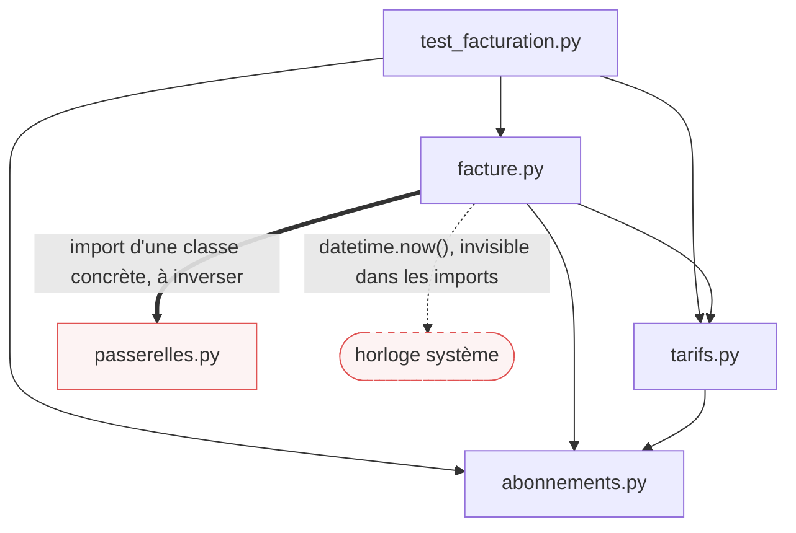

# Analyse SOLID du code de départ

Ce document se construit principe par principe. Chaque section a été discutée et
contestée avant d'être écrite. Une règle de méthode en est sortie, et elle vaut pour
les cinq principes :

> Un symptôme s'attribue au principe **dont la correction le fait disparaître**.
> Si injecter une dépendance suffit à le supprimer, c'était du D, pas du S.

---

## S, Single Responsibility

### Ce que le principe exige

Un module doit être responsable devant **un seul acteur**. Un acteur est une personne ou
un service qui a le pouvoir de demander une modification : la comptabilité, la
communication, l'informatique. Le principe ne parle pas de la taille du code ni du nombre
de choses qu'il fait, il parle de **qui peut demander de le changer**.

Deux précisions sorties de la discussion. Appeler une fonction n'est pas en être
responsable : seul compte ce qui est **implémenté sur place**. Et un fichier dont tout le
contenu parle du même sujet n'est pas pour autant conforme : le critère est l'acteur, pas
le thème.

### La violation

`facturation/facture.py`, ligne 22, la classe `EmetteurDeFactures`.

```python
class EmetteurDeFactures:
    def __init__(self) -> None:
        self.compteur = 0                                   # <- numérotation
        self.passerelle = ClientSMTP()

    def numeroter(self, emise_le: date) -> str:             # <- numérotation
        self.compteur += 1
        return f"{PREFIXE_DE_NUMERO}-{emise_le.year}-{self.compteur:04d}"

    def emettre(self, abonnement, adresse, code_promo=None, premiere_facture=False):
        emise_le = datetime.now().date()
        facture = Facture(
            numero=self.numeroter(emise_le),
            client=abonnement.client,
            emise_le=emise_le,
            montant_ht=montant_hors_taxe(abonnement, code_promo, premiere_facture),
            montant_ttc=montant_toutes_taxes(abonnement, code_promo, premiere_facture),
        )
        corps = "\n".join(                                  # <- mise en forme
            [
                f"Facture {facture.numero}",
                f"Client        : {facture.client}",
                f"Emise le      : {facture.emise_le.isoformat()}",
                f"Formule       : {abonnement.formule}, {abonnement.nombre_de_postes} postes",
                f"Montant HT    : {facture.montant_ht:.2f}",
                f"Montant TTC   : {facture.montant_ttc:.2f}",
            ]
        )
        self.passerelle.envoyer_courriel(adresse, f"Votre facture {facture.numero}", corps)
        return facture
```

Deux préoccupations sont **implémentées sur place** dans cette classe, et elles n'ont
pas le même propriétaire.

| Préoccupation | Où | Acteur | Une demande typique |
|---|---|---|---|
| La règle de numérotation | `self.compteur`, `numeroter()` | la comptabilité | repartir de 1 chaque année, préfixer par entité |
| La présentation du document | le bloc `corps` et l'objet du courriel | la communication | ajouter le logo, détailler la TVA |

Deux acteurs, deux rythmes de changement, une seule classe. C'est la définition de
Martin appliquée à la lettre : un module doit être responsable devant un seul acteur.

### Ce qui n'en fait pas partie, et pourquoi

C'est le piège de cette classe. Deux éléments **ressemblent** à des responsabilités
supplémentaires et n'en sont pas.

**Le calcul des montants.** `emettre` ne calcule rien, elle **appelle**
`montant_hors_taxe` et `montant_toutes_taxes`, qui vivent dans `tarifs.py` et sont
testées directement par sept tests. Déléguer n'est pas être responsable.

**L'envoi.** Le mécanisme d'envoi vit dans `passerelles.py`. Ce que la classe détient,
c'est le choix du fournisseur (`ClientSMTP()` en dur) et le choix du canal. Ces deux
décisions disparaissent dès qu'on injecte l'expéditeur : c'est une violation de **D**.

Vérification faite sur une copie : en injectant la passerelle **sans toucher à la mise
en forme**, le test d'un montant passe sans `capsys`. La pollution des tests par la
sortie standard est donc un symptôme de D, pas de S.

Orchestrer des appels est une responsabilité légitime. Le reproche n'est pas que
`emettre` coordonne trois étapes, c'est qu'elle en **contient** deux au lieu de les
appeler.

### La conséquence, mesurée

Il est impossible d'obtenir le texte d'une facture sans appeler `emettre`, et tout
appel à `emettre` fait avancer le compteur.

```python
emetteur = EmetteurDeFactures()
emetteur.passerelle = PasserelleEnPanne()        # envoyer_courriel lève ConnectionError
try:
    emetteur.emettre(contrat, "compta@dupont.fr")
except ConnectionError:
    pass                                          # aucune facture n'est partie

emetteur.passerelle = ClientSMTP()
print(emetteur.emettre(contrat, "compta@dupont.fr").numero)
# FA-2026-0002   <- le 0001 n'existe nulle part
```

Un envoi qui échoue, une relance, un aperçu avant envoi : chacun consomme un numéro.
Or la numérotation des factures doit être séquentielle et sans rupture. La comptabilité
se retrouve avec un trou à justifier, et la cause est purement structurelle.

Injecter la passerelle ne corrige pas ce défaut. Ouvrir un registre non plus. Seule la
séparation des deux préoccupations le corrige.

### Le critère d'acceptation qui en découle

À la fin de la mission 2, il doit exister un moyen de **produire le texte d'une facture
sans que le compteur bouge**, et un moyen de tester la règle de numérotation sans
construire une seule chaîne de présentation.

### Ce qui a été écarté

| Candidat | Verdict | Raison |
|---|---|---|
| `AbonnementEssai.est_gratuit()` | pas S | c'est une donnée portée par l'abonnement, comme `formule` ; que la tarification l'ignore est un bogue, pas un mélange de responsabilités |
| `ClientSMTP` qui envoie, valide, compte et purge | déjà compté | c'est le défaut de I vu du côté de l'implémenteur |
| `tarifs.py` qui mêle prix, promotions et TVA | discutable | tout y répond à la même question, combien facturer |

---

## O, Open Closed

### Ce que le principe exige

Un module doit être **ouvert à l'extension et fermé à la modification**. Ajouter un
comportement doit se faire en **ajoutant** du code, pas en **éditant** du code qui
marche. Le test à appliquer à chaque fonction : pour ajouter un cas, suis-je obligé de
rouvrir une fonction existante ?

### Ce que « modification » veut dire

L'unité de OCP n'est pas la ligne, c'est **la fonction existante**. Insérer un `if` dans
une fonction, c'est la modifier, même si aucune ligne n'est supprimée : son code change,
tous ses appelants exécutent autre chose, et son comportement n'est de nouveau digne de
confiance qu'après avoir rejoué ses tests.

Le critère vérifiable est donc : **le fichier existant ne bouge pas**, le nouveau
comportement arrive dans un fichier neuf.

```
modification :  tarifs.py        | 2 ++      une unité testée a changé
extension    :  decouverte.py    | 3 +++     tarifs.py est intact
```

### Les trois violations

Toutes dans `facturation/tarifs.py`. Même violation, trois formes différentes.

| # | Site | Ce sur quoi on branche | Forme |
|---|---|---|---|
| 1 | `prix_par_poste`, ligne 21 | la formule | des **valeurs** indépendantes |
| 2 | `taux_de_remise_volume`, ligne 31 | des seuils de postes | une **échelle ordonnée** |
| 3 | `appliquer_code_promo`, ligne 39 | le code promo | des **comportements** indépendants |

#### 1, le catalogue de valeurs

```python
def prix_par_poste(formule: str) -> float:
    if formule == FORMULE_ESSENTIEL:
        return 9.0
    if formule == FORMULE_PRO:
        return 19.0
    if formule == FORMULE_ENTREPRISE:
        return 39.0
    raise FormuleInconnue(formule)
```

Ajouter une formule, c'est rouvrir cette fonction. Facteur aggravant, distinct de OCP :
la constante vit dans `abonnements.py` lignes 6 à 8 et le prix ici, donc une seule
connaissance métier est écrite dans deux fichiers.

#### 2, l'échelle ordonnée

```python
def taux_de_remise_volume(nombre_de_postes: int) -> float:
    if nombre_de_postes >= 50:
        return 0.20
    if nombre_de_postes >= 10:
        return 0.10
    return 0.0
```

Ici les cas ne sont pas indépendants : **la position d'un `if` fait partie de la règle**.
Piège mesuré : on ajoute un palier à 200 postes **à la fin** de la fonction, là où l'on
ajoute naturellement.

```
25 passed
taux pour 200 postes : 0.2   (attendu 0.30)
```

La nouvelle règle est morte, 200 est capté par `>= 50`, et **les 25 tests restent
verts** parce qu'aucun ne teste 200 postes. Dans la forme 1, la position d'un cas est
indifférente. Ici, elle est la règle, et elle n'est écrite nulle part.

#### 3, le catalogue de comportements, et le paramètre qui voyage

```python
def appliquer_code_promo(montant: float, code: str | None, premiere_facture: bool) -> float:
    if code is None:
        return montant
    if code == "BIENVENUE":
        if premiere_facture:
            return max(0.0, montant - 5.0)
        return montant
    if code == "NOEL":
        return montant * 0.85
    raise CodePromoInconnu(code)
```

L'enchaînement de `if` est la partie visible. La partie cachée est `premiere_facture` :
**une seule** promotion en a besoin, et pour le lui apporter le paramètre traverse
**quatre signatures** : `appliquer_code_promo`, `montant_hors_taxe`,
`montant_toutes_taxes` dans `tarifs.py`, puis `emettre` dans `facture.py`.

Toute promotion qui aura besoin d'un nouvel élément de contexte, une date par exemple,
ajoutera un paramètre à ces quatre signatures. Ce n'est plus une fonction rouverte, ce
sont deux fichiers et l'API publique.

### La gravité, honnêtement

Ce sont des violations **par définition**. À cette taille, six lignes et quatre tests,
leur gravité est presque nulle. OCP devient rentable quand la fonction a quarante
branches, que cinq équipes y ajoutent, ou que les cas arrivent souvent. Violation ne
veut pas dire correction obligatoire : c'est la fréquence d'arrivée des cas qui décide.

### Ce qui a été écarté

| Candidat | Verdict | Raison |
|---|---|---|
| `emettre` à éditer pour ajouter un canal SMS | D | injecter l'expéditeur le règle |
| ajouter une méthode à l'interface oblige tous les implémenteurs à changer | I | la cause est l'interface trop large |
| `TAUX_TVA`, un taux unique en dur | pas une violation | aucun branchement, rien n'indique que ça varie |

---

## L, Liskov Substitution

### Ce que le principe exige

Partout où le code attend un `T`, on doit pouvoir lui donner n'importe quel sous-type de
`T` **sans que l'appelant soit surpris**. Le parent porte un contrat, le sous-type doit
le tenir en entier. Avoir les mêmes signatures ne suffit pas : le contrat porte sur le
comportement, et l'interpréteur ne le vérifie pas.

Trois clauses, et un seul sens autorisé pour chacune.

| Clause | Le sous-type a le droit de | Il n'a pas le droit de |
|---|---|---|
| **Préconditions**, ce qu'il exige | accepter **plus** de cas | en refuser que le parent acceptait |
| **Postconditions**, ce qu'il garantit | garantir **plus** | garantir moins |
| **Exceptions** | en lever **moins** | en lever de **nouvelles** |

Un sous-type est plus accommodant que son parent, jamais plus exigeant.

### La violation

`facturation/abonnements.py`, ligne 45, `AbonnementAnnuel`.

Le contrat du parent est écrit noir sur blanc dans sa docstring.

```python
@dataclass
class Abonnement:
    """Un abonnement mensuel.

    Contrat de `resilier` :
      - enregistre la date de fin demandee
      - renvoie la date de fin effective
      - toute date posterieure a la date de debut est acceptee
      - leve ValueError si la date demandee precede la date de debut
    """

    def resilier(self, a_partir_de: date) -> date:
        if a_partir_de < self.debut:
            raise ValueError("une resiliation ne peut pas preceder le debut")
        self.fin = a_partir_de
        return self.fin
```

Et le sous-type.

```python
@dataclass
class AbonnementAnnuel(Abonnement):
    def resilier(self, a_partir_de: date) -> date:
        raise ResiliationImpossible(...)
```

Le même appel, `resilier(date(2026, 7, 1))`, sur les trois types de la hiérarchie :

```
Abonnement         renvoie 2026-07-01, fin = 2026-07-01
AbonnementEssai    renvoie 2026-07-01, fin = 2026-07-01
AbonnementAnnuel   ResiliationImpossible
```

Les **trois** clauses sont brisées d'un coup.

| Clause | Ce que promet le parent | Ce que fait `AbonnementAnnuel` |
|---|---|---|
| Précondition | toute date postérieure au début est acceptée | aucune date n'est acceptée |
| Postcondition | la date de fin est enregistrée et renvoyée | rien n'est enregistré, rien n'est renvoyé |
| Exception | seule `ValueError` peut sortir | `ResiliationImpossible`, qui hérite de `RuntimeError` |

Le choix de `RuntimeError` aggrave les choses. Un appelant qui a lu le contrat et écrit
`except ValueError` ne rattrape pas cette exception. Le traitement de nuit qui parcourt
les abonnements arrivés à terme s'arrête net le jour où un abonnement annuel se trouve
dans la liste.

### La suite de tests entérine la violation

```python
def test_un_abonnement_annuel_refuse_toute_resiliation():
    ...
    with pytest.raises(ResiliationImpossible):
        annuel.resilier(date(2026, 7, 1))
```

Ce test est vert, et il fige le comportement qui viole le contrat. Une suite verte ne dit
rien de LSP tant que les tests du parent ne tournent pas sur les sous-types.

### La règle métier est légitime, c'est sa place qui est fausse

Un abonnement annuel ne se résilie pas avant son terme : la règle est bonne et doit
survivre à la correction. L'erreur est de l'avoir exprimée par un sous-type qui refuse le
contrat de son parent. `AbonnementAnnuel` n'est pas un `Abonnement` au sens du contrat.

### Ce qui a été écarté

| Candidat | Verdict | Raison |
|---|---|---|
| `AbonnementEssai` | conforme | ne redéfinit rien, ajoute seulement `est_gratuit()` ; le bogue de tarification n'est pas un défaut de substitution |
| `ClientSMTP`, dont deux méthodes lèvent `NotImplementedError` | I | c'est bien un échec de substitution, mais découper l'interface le fait disparaître ; la cause est I, le symptôme est L |

---

## I, Interface Segregation

### Ce que le principe exige

Aucun client ne doit être forcé de dépendre de méthodes qu'il n'utilise pas. Une
interface se dimensionne par **le besoin du client**, pas par la richesse du fournisseur.
La bonne question n'est jamais « cette interface est-elle grosse », c'est « ce client
a-t-il besoin de tout ça ».

### La violation

`facturation/passerelles.py`, ligne 6, `PasserelleDeCommunication`.

```python
class PasserelleDeCommunication(ABC):
    @abstractmethod
    def envoyer_courriel(self, destinataire: str, sujet: str, corps: str) -> None: ...
    @abstractmethod
    def envoyer_sms(self, numero: str, texte: str) -> None: ...
    @abstractmethod
    def envoyer_notification_push(self, appareil: str, texte: str) -> None: ...
    @abstractmethod
    def verifier_adresse(self, adresse: str) -> bool: ...
    @abstractmethod
    def statistiques_d_envoi(self) -> dict: ...
    @abstractmethod
    def purger_la_file(self) -> int: ...
```

Qui appelle chacune de ces six méthodes, hors `passerelles.py` et hors tests :

```
envoyer_courriel             1 appel
envoyer_sms                  0
envoyer_notification_push    0
verifier_adresse             0
statistiques_d_envoi         0
purger_la_file               0
```

Le seul client, `EmetteurDeFactures`, utilise **une méthode sur six**. Les six se
répartissent d'ailleurs en trois groupes de clients possibles : l'envoi pour les
fonctionnalités, la vérification d'adresse pour les formulaires, les statistiques et la
purge pour l'exploitation.

### Les deux coûts, mesurés

**Le double de test est hors de prix.** Un double qui n'implémente que ce dont la
facturation a besoin ne peut même pas exister :

```python
class DoubleMinimal(PasserelleDeCommunication):
    def envoyer_courriel(self, destinataire, sujet, corps):
        pass

DoubleMinimal()
# TypeError: Can't instantiate abstract class DoubleMinimal without an implementation
# for abstract methods 'envoyer_notification_push', 'envoyer_sms', 'purger_la_file', ...
```

Pour respecter l'interface, un test doit écrire six méthodes quand il en faut une.

**Les implémentations sont forcées de mentir.** `ClientSMTP` doit définir les six.
Quatre sont factices : deux lèvent `NotImplementedError`, `purger_la_file` renvoie
toujours 0, et `statistiques_d_envoi` fait pire.

```python
smtp = ClientSMTP()
smtp.envoyer_courriel("x@y.fr", "sujet", "corps")
smtp.statistiques_d_envoi()
# {'envoyes': 0}     juste après un envoi
```

Une méthode qui existe parce que l'interface l'exigeait, et qui renvoie une donnée
fausse. C'est la conséquence la plus insidieuse d'une interface trop large : elle ne
produit pas seulement des `NotImplementedError` visibles, elle produit des mensonges
silencieux.

### Le lien avec L

Les deux `NotImplementedError` font de `ClientSMTP` un type non substituable à
`PasserelleDeCommunication`. C'est un symptôme de L dont la cause est ici : découper
l'interface le fait disparaître, puisque `ClientSMTP` ne prétend alors plus qu'à ce
qu'il sait faire.

### Ce qui a été écarté

| Candidat | Verdict | Raison |
|---|---|---|
| `premiere_facture` imposé à toutes les promotions | O | le registre de promotions le règle, déjà compté |
| `montant_hors_taxe` reçoit un `Abonnement` entier et n'en lit que deux champs | non retenu | esprit d'ISP, mais bénin : avec le typage canard, tout objet portant ces deux attributs convient |
| `numeroter` publique sur l'émetteur | S | disparaît quand la numérotation est extraite |

---

## D, Dependency Inversion

### Ce que le principe exige

La **politique** ne doit pas connaître le **mécanisme**. Les règles métier ne dépendent
pas des détails techniques, les deux dépendent d'une abstraction, et cette abstraction
appartient au métier. Corollaire pratique : tout ce qui vient du monde extérieur, le
réseau, l'horloge, le hasard, le disque, la configuration, **entre par un paramètre**
au lieu d'être saisi de l'intérieur.

### Violation 1, le métier importe et construit son mécanisme

`facturation/facture.py`, lignes 7 et 27.

```python
from facturation.passerelles import ClientSMTP          # ligne 7

class EmetteurDeFactures:
    def __init__(self) -> None:
        self.compteur = 0
        self.passerelle = ClientSMTP()                   # ligne 27
```

Le module métier nomme une classe concrète et la construit lui-même. Le constructeur ne
prend aucun argument, donc **il n'existe aucune couture** par où un test pourrait glisser
autre chose.

La preuve est dans la suite de tests livrée : les **trois** tests d'émission ont besoin
de `capsys`, et deux d'entre eux seulement pour faire taire une sortie qui ne les
intéresse pas.

```python
def test_la_facture_porte_les_deux_montants(capsys):
    facture = EmetteurDeFactures().emettre(abonnement(nombre_de_postes=3), "compta@dupont.fr")
    capsys.readouterr()                                   # uniquement pour se taire
    assert facture.montant_ht == 57.0
```

Mesure faite sur une copie : injecter la passerelle, sans rien changer d'autre, supprime
ce besoin. Le test du montant passe sans `capsys`.

Détail de sens : même l'abstraction existante, `PasserelleDeCommunication`, est définie
dans le module du **fournisseur**. La flèche pointe vers le bas à tous les étages.

### Violation 2, le métier lit l'horloge de la machine

`facturation/facture.py`, ligne 40.

```python
emise_le = datetime.now().date()
```

Celle-ci ne se voit pas dans le graphe des imports, parce que `datetime` a l'air anodin.
C'est pourtant une dépendance vers le monde extérieur au même titre qu'un appel réseau.

Le test existant la trahit :

```python
assert premiere.numero.endswith("-0001")
assert seconde.numero.endswith("-0002")
```

`endswith`, jamais le numéro complet. L'auteur **ne pouvait pas** écrire
`== "FA-2026-0001"`, puisque l'année dépend du jour où le test tourne. La règle R8 du
cahier des charges, le format `FA-<année>-<compteur>`, n'est donc ni testée ni testable
en l'état.

### Un troisième cas, à la frontière

`facturation/facture.py`, ligne 26 : `self.compteur = 0`.

```
premier émetteur : FA-2026-0001
second émetteur  : FA-2026-0001     doublon
```

Deux instances émettent le même numéro, et un redémarrage du processus aussi. La règle
« les numéros sont uniques et séquentiels » repose sur un mécanisme, la mémoire de
l'objet, choisi de l'intérieur. Extraire la numérotation, la correction de S, ne règle
rien ici : seule l'injection d'une abstraction de séquence le règle, ce qui pointe
vers D.

C'est aussi, tout simplement, un bogue de persistance manquante. Il est listé à part,
comme `est_gratuit()` : à connaître, pas à exiger des étudiants.

### Ce qui a été écarté

| Candidat | Verdict | Raison |
|---|---|---|
| `tarifs.py` importe `abonnements.py` | sain | du métier vers du métier, dans le bon sens |
| `TAUX_TVA` écrit en dur | pas D | c'est une donnée de politique, pas un mécanisme extérieur |
| le `print` dans `ClientSMTP` | sain | cette classe **est** le mécanisme, c'est son travail |

---

## Bilan des violations

| Principe | Site | En une phrase |
|---|---|---|
| **S** | `facture.py:22`, `EmetteurDeFactures` | numérotation et présentation implémentées dans la même classe, deux acteurs |
| **O** | `tarifs.py:21`, `:31`, `:39` | trois fonctions à rouvrir pour ajouter un cas : valeurs, échelle ordonnée, comportements |
| **L** | `abonnements.py:45`, `AbonnementAnnuel` | les trois clauses du contrat de `resilier` brisées |
| **I** | `passerelles.py:6`, `PasserelleDeCommunication` | six méthodes, un seul client, qui en utilise une |
| **D** | `facture.py:7`, `:27` et `:40` | le métier construit `ClientSMTP` et lit `datetime.now()` |

Deux bogues trouvés en chemin, qui ne sont pas des violations SOLID : `est_gratuit()`
que la tarification ignore, et le compteur en mémoire qui produit des doublons.

---

# Partie 2, les trois demandes sur le code actuel

### Le graphe des dépendances entre fichiers

Une flèche `A --> B` se lit « A importe B ».



Lecture : `abonnements.py` est la feuille, tout le monde en dépend. `tarifs.py` est au
milieu. `facture.py` est en haut et connaît tout le monde, y compris ce qu'il ne devrait
pas connaître : les deux flèches rouges sont les deux violations de D.

Conséquence pour la suite : modifier un fichier oblige à se méfier de **tous ceux qui
pointent vers lui**, directement ou non.

| Si on modifie | Ceux qui en dépendent |
|---|---|
| `abonnements.py` | `tarifs.py`, `facture.py`, les tests : toute l'application |
| `tarifs.py` | `facture.py`, les tests |
| `passerelles.py` | `facture.py` |
| `facture.py` | les tests seulement |

### Ce que chaque demande oblige à changer

| Demande | Fichiers modifiés | Dans ces fichiers | Fichiers à revérifier par dépendance |
|---|---|---|---|
| **D1**, formule `decouverte` à 4 euros | `abonnements.py`, `tarifs.py` | la constante `FORMULE_DECOUVERTE` lignes 6 à 8 ; le bloc d'import lignes 3 à 8 et `prix_par_poste` ligne 21 | `facture.py` et tous les tests, puisque `abonnements.py` est la feuille du graphe |
| **D2**, code promo `RENTREE` à 10 pour cent | `tarifs.py` | `appliquer_code_promo` ligne 39, un `if` de plus | `facture.py` et les tests |
| **D3**, palier de 30 pour cent à 200 postes | `tarifs.py` | `taux_de_remise_volume` ligne 31, un `if` de plus, **en première position** | `facture.py` et les tests |

Dans les trois cas s'ajoute le fichier de tests, pour couvrir le nouveau cas.

Trois remarques.

**D1 est la seule à toucher deux fichiers**, et elle touche la feuille du graphe : c'est
la demande au plus grand rayon d'effet, pour la plus petite règle métier.

**D2 reste dans un seul fichier parce que `RENTREE` est sans condition.** Si la promotion
n'était valable qu'en septembre, il lui faudrait une date, et ce paramètre devrait
traverser quatre signatures dans deux fichiers, comme `premiere_facture` aujourd'hui.

**D3 est la seule où l'emplacement de la modification compte.** Ajouté en fin de
fonction, le nouveau palier ne s'applique jamais et les 25 tests restent verts.
